## I. Limites infinies

???+ question "Un premier exemple"

    Observons la représentation graphique de la fonction $f$.

    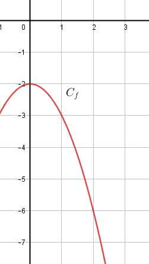{ width=10% }

    Lorsque $x$ devient "très très grand", c'est-à-dire lorsque $x$ se "rapproche" de $+ \infty$, on voit que $f(x)$ se "rapproche" de $- \infty$.   
    On dit que lorsque $x$ **tend** vers $+ \infty$, alors $f(x)$  **tend** vers $- \infty$.  

    On note : 

    !!! info "Notattion"

        On note : 
        
        $$
        \lim_{x\to +\infty} f(x) = -\infty
        $$

        On lit : "la limite lorsque $x$ tend vers $+\infty$ de $f(x)$ est égale à $-\infty$"

???+ question "Un deuxième exemple"

    Observons la représentation graphique de la fonction $f$.

    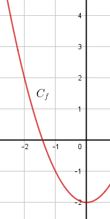{ width=10% }

    par analogie, donner la limite de $f$ que l'on peut observer

    ??? success "Solution"

        $$
        \lim_{x\to -\infty} f(x) = +\infty
        $$

        On lit : "la limite lorsque $x$ tend vers $-\infty$ de $f(x)$ est égale à $+\infty$"

???+ question "Un troisième exemple"

    Observons la représentation graphique de la fonction $f$.

    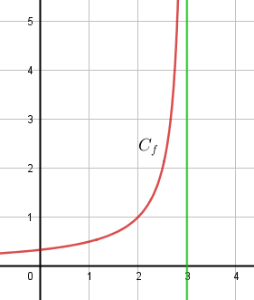{ width=15% }

    Lorsque $x$ devient de plus en plus proche de 3, en restant inférieur à 3, on voit que $f(x)$ se "rapproche" de $+ \infty$.   
    On dit que lorsque $x$ **tend** vers 3 en étant inférieur 3, alors $f(x)$  **tend** vers $+ \infty$.  

    !!! info "Notation"

        On note : 
            
        $$
        \lim_{\substack{x\to 3 \\ x<3}} f(x) = +\infty
        $$

        On lit : "la limite lorsque $x$ tend vers 3 avec $x$ inférieur 3, de $f(x)$ est égale à $+\infty$"

    !!! info "Asymptote"

        On observe que la courbe représentative de la fontion $f$ notée $C_f$ "s'approche" de plus en plus de la droite d'équation $x=3$ lorsque $x$ tend vers 3.

        **On dit que la droite d'équation $x=3$ est une asymptote verticale à la courbe $C_f$**

???+ question "Un quatrième exemple"

    Observons la représentation graphique de la fonction $f$.

    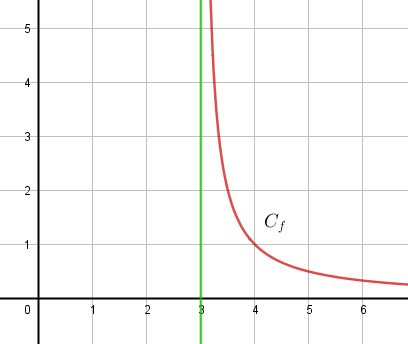{ width=15% }

    Lorsque $x$ devient de plus en plus proche de 3, en restant supérieur à 3, on voit que $f(x)$ se "rapproche" de $+ \infty$.   
    On dit que lorsque $x$ **tend** vers 3 en étant supérieur à 3, alors $f(x)$  **tend** vers $+ \infty$.  

    !!! info "Notation"

        On note : 
            
        $$
        \lim_{\substack{x\to 3 \\ x>3}} f(x) = +\infty
        $$

        On lit : "la limite lorsque $x$ tend vers 3 avec $x$ supérieur à 3, de $f(x)$ est égale à $+\infty$"

    !!! info "Asymptote"

        On observe que la courbe représentative de la fontion $f$ notée $C_f$ "s'approche" de plus en plus de la droite d'équation $x=3$ lorsque $x$ tend vers 3.

        **On dit que la droite d'équation $x=3$ est une asymptote verticale à la courbe $C_f$**

???+ question "Un cinquième exemple"

    Observons la représentation graphique de la fonction $f$.

    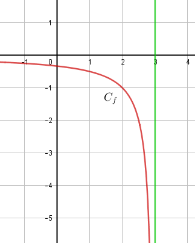{ width=15% }

    Quelle limite peut-on observer ?

    ??? success "Solution"

        Lorsque $x$ devient de plus en plus proche de 3, en restant inférieur à 3, on voit que $f(x)$ se "rapproche" de $- \infty$.   
        On dit que lorsque $x$ **tend** vers 3 en étant inférieur à 3, alors $f(x)$  **tend** vers $- \infty$.  

        !!! info "Notation"

            On note : 
                
            $$
            \lim_{\substack{x\to 3 \\ x<3}} f(x) = -\infty
            $$

            On lit : "la limite lorsque $x$ tend vers 3 avec $x$ inférieur à 3, de $f(x)$ est égale à $-\infty$"

    Donner une asymptote à la courbe $C_f$.

    ??? success "Solution"

        On observe que la courbe représentative de la fontion $f$ notée $C_f$ "s'approche" de plus en plus de la droite d'équation $x=3$ lorsque $x$ tend vers 3.

        **On dit que la droite d'équation $x=3$ est une asymptote verticale à la courbe $C_f$**

???+ question "Un sixième exemple"

    Observons la représentation graphique de la fonction $f$.

    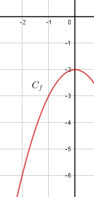{ width=15% }

    Quelle limite peut-on observer ? Donner la notation correspondante.

    ??? success "Solution"

        On note : 

        $$
        \lim_{x\to -\infty} f(x) = -\infty
        $$

???+ question "Un septième exemple"

    Observons la représentation graphique de la fonction $f$.

    { width=15% }

    Quelle limite peut-on observer ? Donner la notation correspondante.

    ??? success "Solution"

        On note : 

        $$
        \lim_{x\to +\infty} f(x) = -\infty
        $$

## II. Pas de limite

???+ question "Un huitième exemple"

    Observons la représentation graphique de la fonction $f$.

    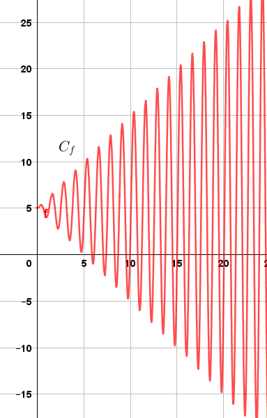{ width=15% }

    !!! info "Pas de limite"

        La fonction $f$ n'a pas de limite en $+ \infty$

???+ question "Un neuvième exemple"

    Observons la représentation graphique de la fonction $f$.

    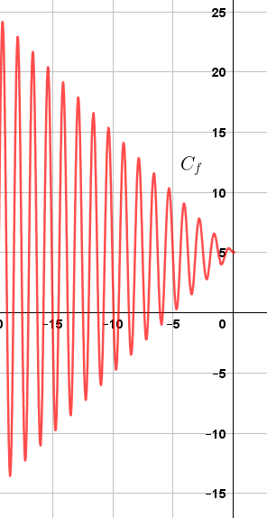{ width=15% }

    !!! info "Pas de limite"

        La fonction $f$ n'a pas de limite en $- \infty$

## III. Limites finies

???+ question "Un dixième exemple"

    Observons la représentation graphique de la fonction $f$.

    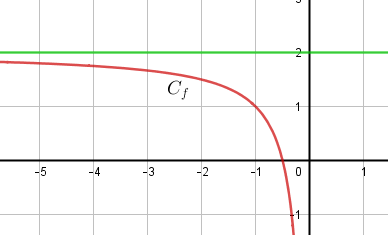{ width=25% }

    Lorsque $x$ tend vers $- \infty$, on voit que $f(x)$ se "rapproche" de 2.   
    On dit que lorsque $x$ **tend** vers $- \infty$, alors $f(x)$  **tend** vers 2.  

    On note : 

    !!! info "Notation"

        On note : 
        
        $$
        \lim_{x\to -\infty} f(x) = 2
        $$

        On lit : "la limite lorsque $x$ tend vers $-\infty$ de $f(x)$ est égale à 2"

    !!! info "Asymptote"

        On observe que la courbe représentative de la fontion $f$ notée $C_f$ "s'approche" de plus en plus de la droite d'équation $y=2$ lorsque $x$ tend vers $- \infty$.

        **On dit que la droite d'équation $y=2$ est une asymptote horizontale à la courbe $C_f$ en $- \infty$**

???+ question "Un onzième exemple"

    Observons la représentation graphique de la fonction $f$.

    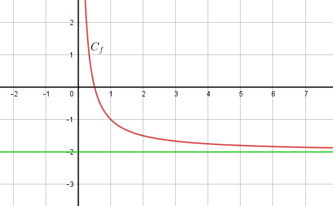{ width=25% }

    Donner la limite que l'on peut observer. En donner la notation.
    

    ??? success "Solution"

        On note : 
        
        $$
        \lim_{x\to +\infty} f(x) = -2
        $$

        On lit : "la limite lorsque $x$ tend vers $+\infty$ de $f(x)$ est égale à -2"

    Quelle asymptote observe-t-on ?

    ??? success "Solution"

        **On dit que la droite d'équation $y=-2$ est une asymptote horizontale à la courbe $C_f$ en $+ \infty$**

???+ question "Un douzième exemple"

    Observons la représentation graphique de la fonction $f$.

    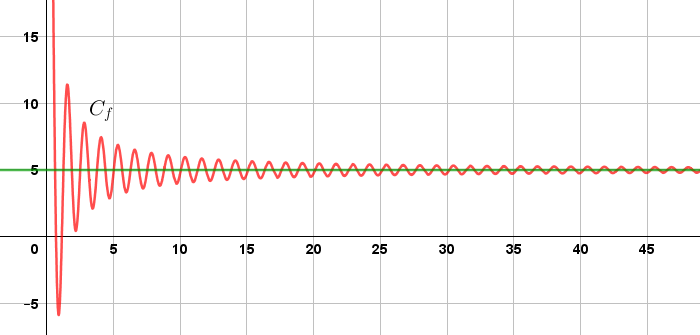{ width=40% }

    Donner la limite que l'on peut observer. En donner la notation.

    ??? success "Solution"

        On note : 
        
        $$
        \lim_{x\to +\infty} f(x) = 5
        $$
    
    Quelle asymptote observe-t-on ?

    ??? success "Solution"

        **On dit que la droite d'équation $y=5$ est une asymptote horizontale à la courbe $C_f$ en $+ \infty$**
    

## IV. Bilan

[Quelques vidéos](https://jaicompris.com/lycee/math/fonction/limite-fonction-graphique.php){ .md-button target="_blank" rel="noopener" }

## V. Exercices

???+ question "Exercice"

    **1.** Observons la représentation graphique de la fonction $f$.

    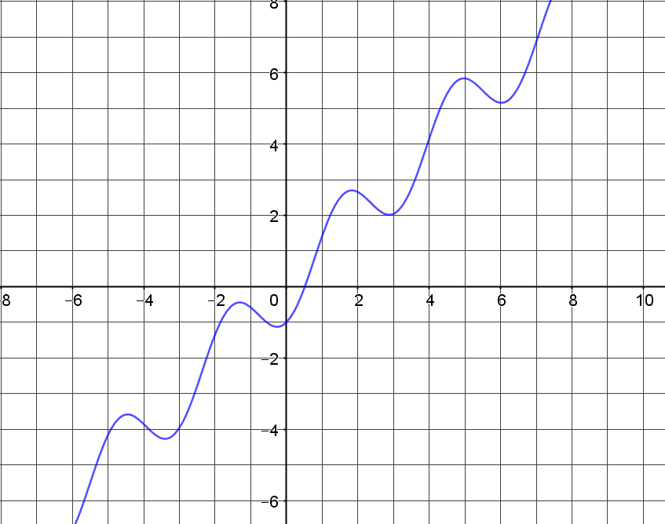{ width=30% }

    Donner la ou les limites que l'on peut observer, et s'il y en a les équations des asymptotes à la courbe.

    ??? success "Solution"

        ...
        
    **2.** Observons la représentation graphique de la fonction $f$.

    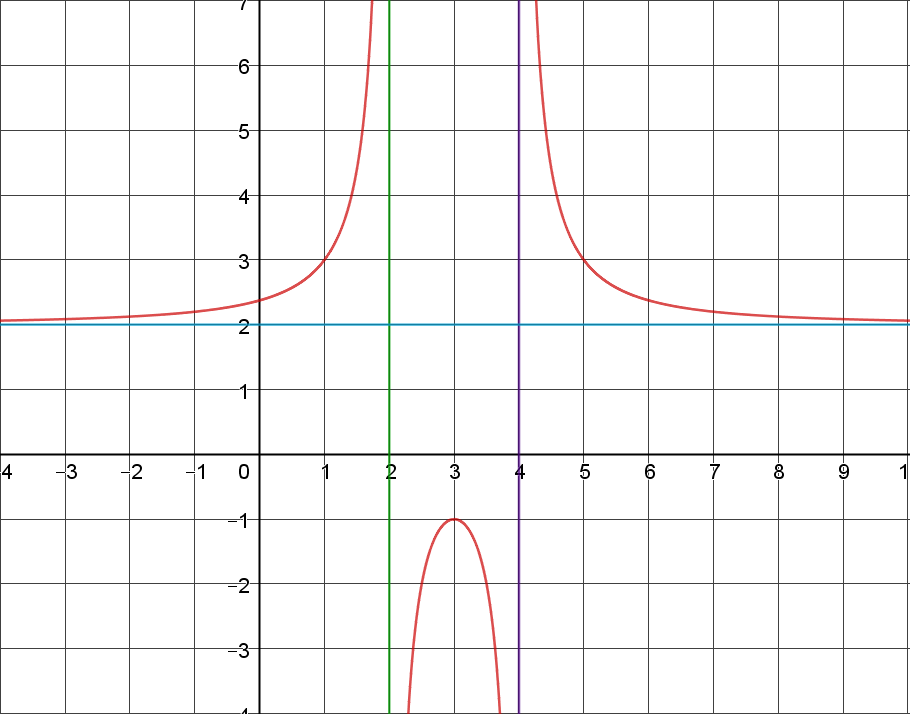{ width=30% }

    Donner la ou les limites que l'on peut observer, et s'il y en a les équations des asymptotes à la courbe.

    ??? success "Solution"

        ...

    **3.** Observons la représentation graphique de la fonction $f$.

    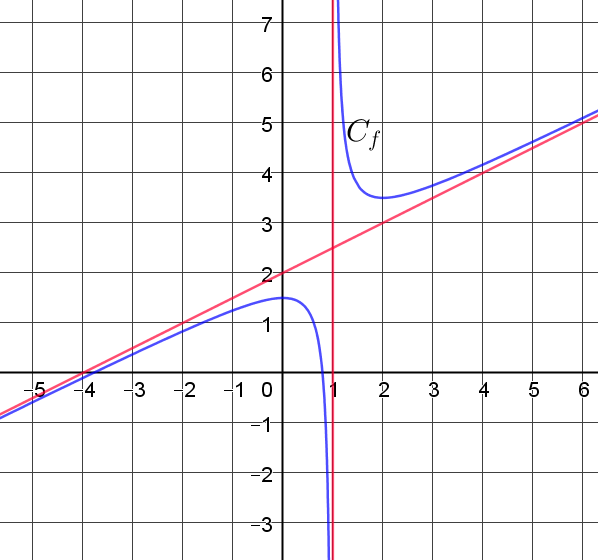{ width=30% }

    Donner la ou les limites que l'on peut observer, et s'il y en a les équations des asymptotes à la courbe.

    ??? success "Solution"

        ...

