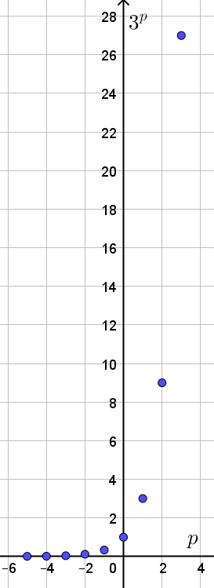
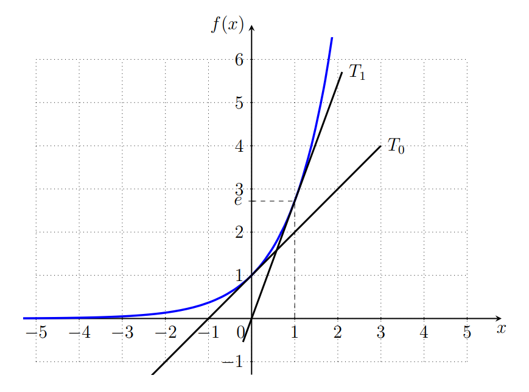

 [Prérequis : maîtriser les formules sur les puissances](https://mcoilhac.forge.apps.education.fr/prerequis-maths-premiere/puissances/puissances/){ .md-button target="_blank" rel="noopener" }

## I. Une analogie

Nous allons nous intéresser à $3^p$ avec p un entier relatif.

??? note "Les entiers relatifs"

    * L'ensemble ds entiers relatifs se note $\mathbb{Z}$
    * $p \in \mathbb{Z}$ signifie que $p \in \{ ..., -3, -2, -1, 0, 1, 2, 3, ... \}$

???+ question "Visualiser"

    **1.** Remplir le tabeau suivant avec des valeurs à 0,0001 près

    $$\begin{array}{|c|c|c|c|c|c|c|c|c|c|c|c|}
    \hline
	p & -5 & -4 & -3 & -2 & -1 & 0 & 1 & 2 & 3 & 4 & 10 \\
    \hline
	3^p &...& ... &  ... & ... & ... & ... & ... & ...& ...& ...& ...\\
    \hline
    \end{array}$$

    ??? success "Solution"

        $$\begin{array}{|c|c|c|c|c|c|c|c|c|c|c|c|}
        \hline
        p & -5 & -4 & -3 & -2 & -1 & 0 & 1 & 2 & 3 & 4 & 10 \\
        \hline
        3^p &0,004& 0,012 &  0,037 & 0,111 & 0,333 & 1 & 3 & 9 & 27& 81& 59049 \\
        \hline
        \end{array}$$

    **2.** Faire une représentation graphique du tableau précédent avec $p$ en abscisses et $3^p$ en ordonnée

    ??? success "Solution"

        { width=15% }

## II. Définition

!!! info "La fonction exponentielle"

    Il existe une unique fonction $f$ définie et dérivable sur $\mathbb{R}$ telle que
    $f(0)=1$ et $f'=f$. 

    Cette fonction est appelée exponentielle. 

    On note $f(x)=\text{e}^x$

!!! info "À retenir"

    * La fonction exponentielle est dérivable sur $\mathbb{Z}$ et $(\text{e}^x)' = \text{e}^x$

    * $\text{e}^0 = 1$

!!! info "Représentation graphique"

    { width=40% }

???+ question "Signe de $f(x)=\text{e}^x$"

    Observer la figure précédente, et donner le signe de $f(x)=\text{e}^x$ pour tout réel $x$.

    ??? success "Solution"

        On observe que la courbe représentative de la fonction exponentielle est au dessus de l'axe des abscisses.

        On en déduit que pour tout réel $x$ on a $\text{e}^x >0$

??? note "À savoir : signe de $\text{e}^x$"

    Pour tout réel $x$ on a $\text{e}^x >0$

## III. Relations fonctionnelles

!!! info "À retenir"

    * $\text{e}^{x+y} = \text{e}^x \times \text{e}^y$
    * $\text{e}^{-x} = \dfrac{1}{\text{e}^x}$
    * $\text{e}^{x-y} = \dfrac{\text{e}^x}{\text{e}^y}$
    * $\text{e}^{nx} = (\text{e}^x)^n$

???+ question "À vous de jouer"

    [Exercices : relations fonctionnelles](https://coopmaths.fr/alea/?uuid=ce463&id=can1F26&n=5&d=10&s=1&s2=8&alea=zZzt&cd=1&uuid=9325e&id=1AN30-2&n=10&d=10&s=2&s2=8&alea=wb2Z&cd=1&uuid=ce463&id=can1F26&n=10&d=10&s=3&s2=8&alea=10Qo&cd=1&v=eleve&es=0111001&title=){ .md-button target="_blank" rel="noopener" }

    

        

