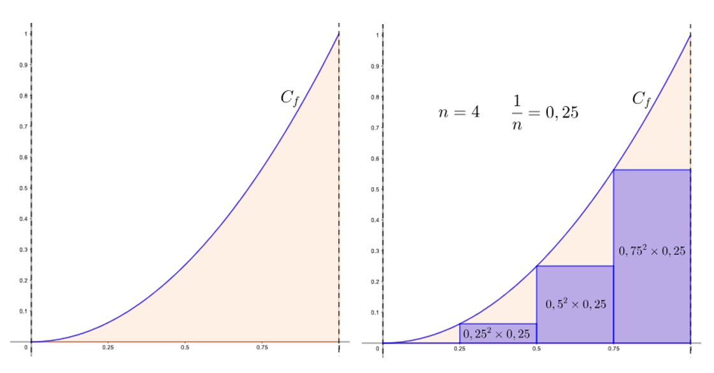
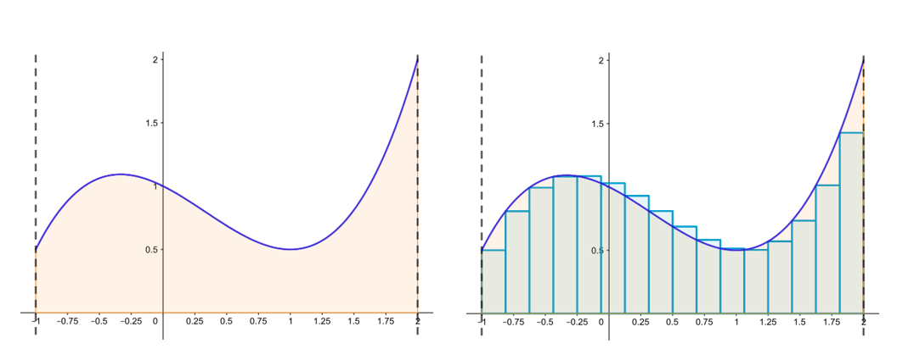
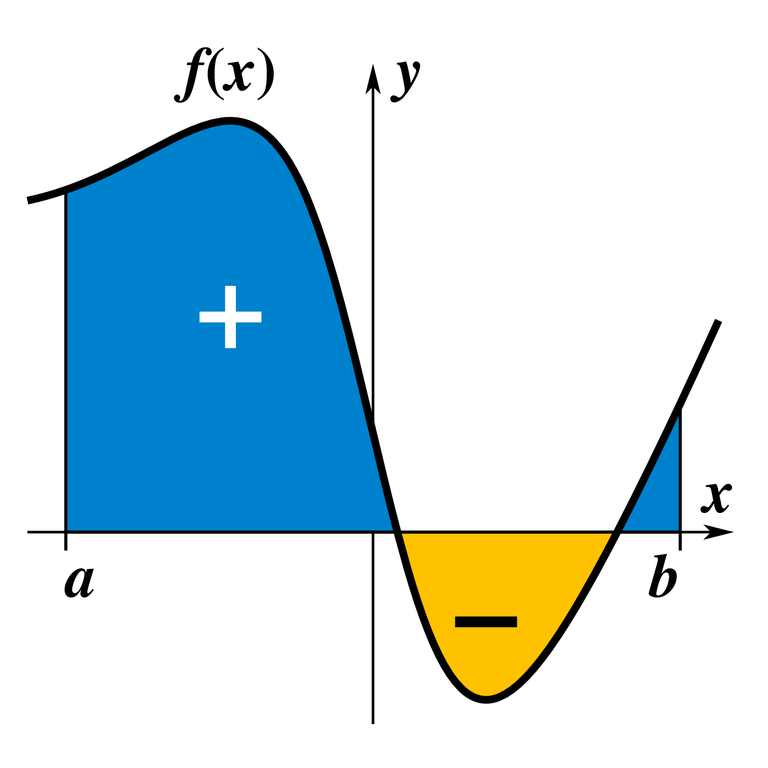

## I. Découvertes

???+ question "Aire sous la courbe de la fonction carré, pour $x$ variant entre 0 et 1"

    On considère dans cet exercice la fonction $f$ définie sur $\left[0~;~1\right]$ par $f(x)=x^2$. On appelle $C_f$ sa représentation graphique dans un repère orthonormé.

    On cherche à calculer une valeur approchée de l'aire du domaine situé entre :

    * l'axe des abscisses ;
    * la courbe $C_f$ ;
    * les droites d'équations $x=0$ et $x=1$.

    Ce domaine est colorié ci-dessous (à gauche).

    { width=90% }

    Il est possible de calculer cette valeur approchée en utilisant la *méthode des rectangles*  suivante :

    * on découpe l'intervalle $\left[0~;~1\right]$ en $n>0$ subdivisions régulières. Chaque subdivision a une largeur de $\dfrac1n$ ;
    * il est possible de numéroter chaque subdivision avec un entier $0 \leqslant k < n$ ;
    * dans la $k$-ième subdivision, on dessine le rectangle de largeur $\dfrac{1}{n}$ et de hauteur $\left(k\times \dfrac{1}{n}\right)^2$ ;
    * la somme des aires de tous les rectangles donne une valeur approchée (par défaut) de l'aire du domaine étudié.

    La figure de droite illustre cette méthode dans le cas $n=4$. La valeur approchée obtenue vaut alors :

    $$0^2\times0,25+0,25^2\times0,25+0,5^2\times0,25+0,75^2\times0,25=0,21875$$

    Il est clair que plus le nombre de subdivisions est important, plus la valeur calculée est proche de la valeur exacte de l'aire cherchée.

    On donne la fonction `aire` qui prend en paramètre un entier `n` strictement positif et renvoie la valeur approchée renvoyée par la méthode des rectangles décrite utilisant $n$ rectangles.

    Exécuter le code ci-dessous : 

    {{ IDE('exo_carre') }}

    Présentée en termes mathématiques, cette formule devient :

    $$A_n=\left(\dfrac0n\right)^2\times \text{d}x+\left(\dfrac1n\right)^2\times \text{d}x+\left(\dfrac2n\right)^2\times \text{d}x+\dots+\left(\dfrac{n-1}n\right)^2\times \text{d}x$$

    Lorsque $n$ tend vers $+\infty$ cette somme tend vers l'aire du domaine étudié. On note cette aire à l'aide d'une **intégrale** :

    $$A=\int_0^1 x^2\text{d}x$$

    La valeur exacte de cette intégrale est $\dfrac13$.

???+ question "Aire sous la courbe d'une fonction polynomiale de degré 3, pour x variant de -1 à 2"

    Soient $a$ et $b$ deux nombres réels ($a < b$) et $f$ une fonction continue telle que l'on ait $f(x)\ge0$ sur $\left[a~;~b\right]$. On appelle $C_f$ la représentation graphique de $f$ dans un repère orthonormé.

    On cherche à calculer une valeur approchée de l'aire du domaine situé entre :

    * l'axe des abscisses ;

    * la courbe $C_f$ ;
    * les droites d'équations $x=a$ et $x=b$.

    La figure ci-dessous (à gauche) illustre le problème avec :

    { width=90% }

    * $f(x) = \frac12x^3 - \frac12 x^2 - \frac12 x + 1$ ;

    * $a=-1$ ;
    * $b = 2$.

    { width=90% }

    Il est possible de calculer cette valeur approchée en utilisant la *méthode des rectangles* suivante :

    * on découpe l'intervalle $\left[a~;~b\right]$ en $n>0$ subdivisions régulières. Chaque subdivision a pour largeur $\text{d}x=\dfrac{b-a}n$ ;
    * il est possible de numéroter chaque subdivision avec un entier $0 \leqslant k < n$ ;
    * dans la $k$-ième subdivision, on dessine le rectangle de largeur $\text{d}x$ et de hauteur $f\left(a+k\text{d}x\right)$ ;
    * la somme des aires de tous les rectangles donne une valeur approchée de l'aire du domaine étudié.

    La figure de droite illustre cette méthode dans le cas $n=16$. La valeur approchée obtenue vaut alors :

    $$f(-1)\times\text{d}x+f(-1+\text{d}x)\times\text{d}x+f(-1+2\text{d}x)\times\text{d}x+\dots+f(-1+15\text{d}x)\times\text{d}x\simeq2,4888$$

    Il est clair que plus le nombre de subdivisions est important, plus la valeur calculée est proche de la valeur exacte de l'aire cherchée.

    On donne la fonction `aire` qui prend en paramètres les entiers `a` et `b` ainsi que l'entier `n` strictement positif et renvoie la valeur approchée renvoyée par la méthode des rectangles décrite utilisant $n$ rectangles.

    Exécuter le code ci-dessous : 

    {{ IDE('exo_cubique') }}

    Lorsque $n$ tend vers $+\infty$ la somme calculée tend vers l'aire du domaine étudié. On note cette aire à l'aide d'une **intégrale** :

    $$A=\int_a^b f(x)\text{d}x$$

    La valeur exacte de cette intégrale est $2,625$.

## II. Définition

!!! info "Aire sous la courbe d’une fonction, intégrale"

    Si $f$ est un fonction continue et positive sur $[a;b]$, l’intégrale  est l’aire du domaine colorié notée $A=\int_a^b f(x)\text{d}x$, mesurée en unités d’aires.

    { width=90% }

!!! info "Aire entre deux courbes"

    Soit $f$ et $g$ deux fonctions continues sur $[a;b]$, de signes quelconques, avec $a < b$. 
    
    Si pour tout $x$ de $[a;b]$ on a $f(x) ⩽ g(x)$, alors l’aire située entre les courbes de $f$ et $g$ sur $[a;b]$ est  $A=\int_a^b (g(x)-f(x))\text{d}x$ en unité d’aires.

    { width=25% }
    Source : jaicompris.com

!!! info "Aire et intégrale"

    { width=25% }
    Source : KSmrq sur Wikimedia Commons

    $A=\int_a^b f(x)\text{d}x$

    Faire varier les curseurs $a$ et $b$ et observer le signe de $A=\int_a^b f(x)\text{d}x$ :

    <iframe src="https://www.geogebra.org/m/aS42bhqn" width="600" height="400"></iframe>

## III. Primitive d'une fonction

!!! info "Primitives"

    Soit $f$ une fonction définie sur un intervalle $I$. On appelle $F$ primitive de $f$ sur $I$, toute fonction dont la dérivée sur $I$ est $f$. 
    
    C’est-à-dire que $F$ est une primitive de $f$ lorsque $F'(𝑥) = f(𝑥)$ pour tout $𝑥 \in I$. 

!!! info "Intégrale et primitive"

    $$\int_{a}^{b} f(x) \, dx = F(b) - F(a) $$ où $F$ est une primitive de $f$ sur $[a;b]$

!!! info "Méthode pour vérifier que $F$ est une primitive de $f$"

    Il suffit de déterminer $F'$ et de vérifier que $F'=f$

## IV. Valeur moyenne d'une fonction

[Comprendre la valeur moyenne](https://www.geogebra.org/m/aw6nbtky){ .md-button target="_blank" rel="noopener" }

[Manipuler la valeur moyenne](https://www.geogebra.org/m/U5qkpUvg){ .md-button target="_blank" rel="noopener" }

!!! info "Valeur moyenne d'une fonction"

    $$m= \dfrac{1}{b-a} \int_{a}^{b} f(x) \, dx$$

    [Visualiser moyenne et aire](https://www.geogebra.org/m/ssu7z9JB){ .md-button target="_blank" rel="noopener" }

## V. Exercices

[Exercices - primitives](https://coopmaths.fr/alea/?uuid=d09fe&id=TSA6-QCM01&alea=z9XK&uuid=570b7&id=TSA6-QCM02&alea=kHVt&uuid=4f818&id=TSA5-QCM04&alea=nxuT&uuid=3ca11&id=TSA6-QCM04&alea=k1PJ&v=eleve&es=1211001&title=){ .md-button target="_blank" rel="noopener" }

???+ question "Exercice 1 BTS SIO Polynésie 16 mai 2024"

    Une entreprise fabrique entre 1000 et 15000 composants pour téléphones portables par jour. On admet que si l’entreprise fabrique $x$ milliers de composants par jour le bénéfice de l’entreprise en centaines d’euros est modélisé parla fonction $f$ définie sur l’intervalle $[1; 15]$ par : $f(x) = - x \ln (x) + 2x$

    On note $f'$ la fonction dérivée de la fonction $f$.

    **Partie A**

    **1.** a. Un logiciel de calcul formel donne l'expression suivante pour la dérivée de la fonction $x \longmapsto  x \ln (x)$ :

    $$\begin{center}	
    \begin{tabular}{|m{1cm}|m{3cm}|}\hline
    1&$x \ln (x)$\\ \hline
    ~&Dérivée : $\ln (x) + 1$\\ \hline
    \end{tabular}
    \end{center}$$

    En déduire l'expression de $f'(x)$ pour tout $x$ appartenant à l'intervalle [1~;~15].

	b. Étudier le signe de $f'(x)$ sur l'intervalle [1~;~15].
	c. En déduire le tableau de variation de la fonction $f$ (les images seront, si besoin, arrondies au centième).
	d. Déterminer la valeur du maximum de $f$ sur l'intervalle [1~;~15] et préciser pour quelle valeur ce maximum est atteint.
	
    **2.** a. Démontrer que l'équation $f(x) = 0$ admet une unique solution $a$ dans l'intervalle [1~;~15], puis en déterminer, à l'aide de la calculatrice, une valeur approchée au centième.

    b. En déduire le signe de $f$ sur l'intervalle [1~;~15]

    **3.** a. Vérifier que la fonction $F$ définie sur [1~;~15], par 
		
		\[F(x) = x^2 \left(\dfrac54 - \dfrac12 \ln (x)\right)\] est une primitive de la fonction $f$ sur l'intervalle [1~;~15]

    b. Donner une valeur approchée de l'intégrale 
		\[\displaystyle\int_2^6 f(x) \:\text{d}x\] à $10^{-2}$ près.

    **Partie B**

    **1.** Déterminer le bénéfice maximal à l'euro près réalisé par l'entreprise et le nombre de composants pour le réaliser.

    **2.** a. Justifier alors que l'entreprise réalise un bénéfice positif.

    b. Pour une telle production, on admet que le bénéfice moyen de l'entreprise, en centaines d'euros, est donné par:

    \[\mu = \dfrac14 \displaystyle\int_2^6 f(x)\:\text {d}x.\]

    Déterminer, à l'euro près, la valeur de ce bénéfice moyen.

    

## Crédits

Nicolas Revéret, Pierrick Vaire

