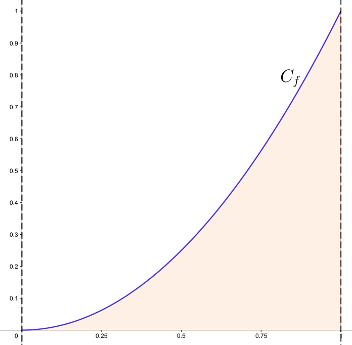
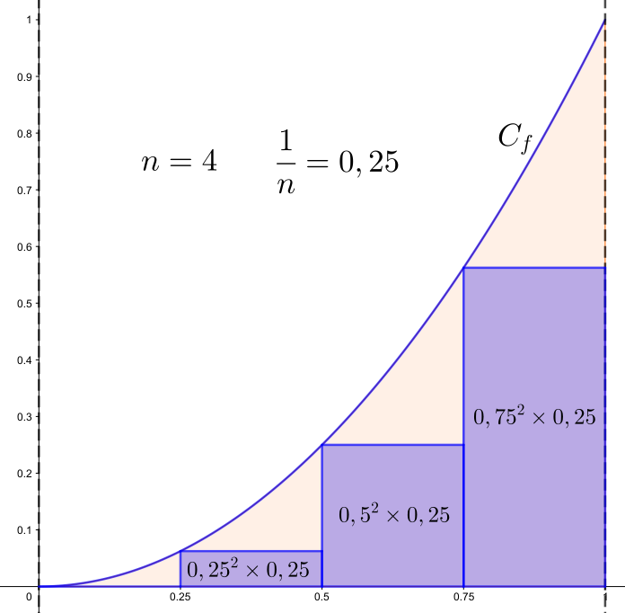
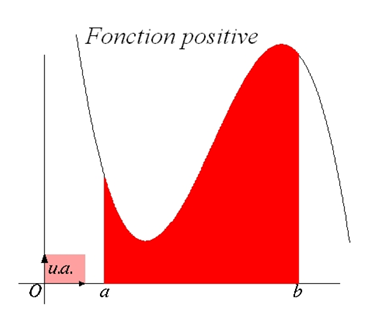
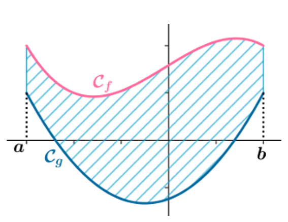

## I. Découvertes

### Aire sous la courbe de la fonction carré, pour $x$ variant entre 0 et 1

On considère dans cet exercice la fonction $f$ définie sur $\left[0~;~1\right]$ par $f(x)=x^2$. On appelle $C_f$ sa représentation graphique dans un repère orthonormé.

On cherche à calculer une valeur approchée de l'aire du domaine situé entre :

* l'axe des abscisses ;
* la courbe $C_f$ ;
* les droites d'équations $x=0$ et $x=1$.

Ce domaine est colorié ci-dessous (à gauche).

    
    

Il est possible de calculer cette valeur approchée en utilisant la *méthode des rectangles* [^1] suivante :

[^1]: On propose ici une version simplifiée de cette méthode qui considère des rectangles ayant tous la même largeur.

* on découpe l'intervalle $\left[0~;~1\right]$ en $n>0$ subdivisions régulières. Chaque subdivision a une largeur de $\dfrac1n$ ;
* il est possible de numéroter chaque subdivision avec un entier $0 \leqslant k < n$ ;
* dans la $k$-ième subdivision, on dessine le rectangle de largeur $\dfrac{1}{n}$ et de hauteur $\left(k\times \dfrac{1}{n}\right)^2$ ;
* la somme des aires de tous les rectangles donne une valeur approchée (par défaut) de l'aire du domaine étudié.

La figure de droite illustre cette méthode dans le cas $n=4$. La valeur approchée obtenue vaut alors :

$$0^2\times0,25+0,25^2\times0,25+0,5^2\times0,25+0,75^2\times0,25=0,21875$$

Il est clair que plus le nombre de subdivisions est important, plus la valeur calculée est proche de la valeur exacte de l'aire cherchée.

On donne la fonction `aire` qui prend en paramètre un entier `n` strictement positif et renvoie la valeur approchée renvoyée par la méthode des rectangles décrite utilisant $n$ rectangles.

Exécuter le code ci-dessous : 

{{ IDE('exo_carre') }}

Présentée en termes mathématiques, cette formule devient :

$$A_n=\left(\dfrac0n\right)^2\times \text{d}x+\left(\dfrac1n\right)^2\times \text{d}x+\left(\dfrac2n\right)^2\times \text{d}x+\dots+\left(\dfrac{n-1}n\right)^2\times \text{d}x$$

Lorsque $n$ tend vers $+\infty$ cette somme tend vers l'aire du domaine étudié. On note cette aire à l'aide d'une **intégrale** :

$$A=\int_0^1 x^2\text{d}x$$

La valeur exacte de cette intégrale est $\dfrac13$.

### Aire sous la courbe d'une fonction polynomiale de degré 3, pour x variant de -1 à 2

Soient $a$ et $b$ deux nombres réels ($a < b$) et $f$ une fonction continue telle que l'on ait $f(x)\ge0$ sur $\left[a~;~b\right]$. On appelle $C_f$ la représentation graphique de $f$ dans un repère orthonormé.

On cherche à calculer une valeur approchée de l'aire du domaine situé entre :

* l'axe des abscisses ;

* la courbe $C_f$ ;
* les droites d'équations $x=a$ et $x=b$.

La figure ci-dessous (à gauche) illustre le problème avec :

* $f(x) = \frac12x^3 - \frac12 x^2 - \frac12 x + 1$ ;

* $a=-1$ ;
* $b = 2$.

    
    

Il est possible de calculer cette valeur approchée en utilisant la *méthode des rectangles* [^1] suivante :

[^1]: On propose ici une version simplifiée de cette méthode qui considère des rectangles ayant tous la même largeur.

* on découpe l'intervalle $\left[a~;~b\right]$ en $n>0$ subdivisions régulières. Chaque subdivision a pour largeur $\text{d}x=\dfrac{b-a}n$ ;
* il est possible de numéroter chaque subdivision avec un entier $0 \leqslant k < n$ ;
* dans la $k$-ième subdivision, on dessine le rectangle de largeur $\text{d}x$ et de hauteur $f\left(a+k\text{d}x\right)$ ;
* la somme des aires de tous les rectangles donne une valeur approchée de l'aire du domaine étudié.

La figure de droite illustre cette méthode dans le cas $n=16$. La valeur approchée obtenue vaut alors :

$$f(-1)\times\text{d}x+f(-1+\text{d}x)\times\text{d}x+f(-1+2\text{d}x)\times\text{d}x+\dots+f(-1+15\text{d}x)\times\text{d}x\simeq2,4888$$

Il est clair que plus le nombre de subdivisions est important, plus la valeur calculée est proche de la valeur exacte de l'aire cherchée.

On donne la fonction `aire` qui prend en paramètres les entiers `a` et `b` ainsi que l'entier `n` strictement positif et renvoie la valeur approchée renvoyée par la méthode des rectangles décrite utilisant $n$ rectangles.

Exécuter le code ci-dessous : 

{{ IDE('exo_cubique') }}

Lorsque $n$ tend vers $+\infty$ la somme calculée tend vers l'aire du domaine étudié. On note cette aire à l'aide d'une **intégrale** :

$$A=\int_a^b f(x)\text{d}x$$

La valeur exacte de cette intégrale est $2,625$.

## II. Définition

!!! info "Aire sous la courbe d’une fonction, intégrale"

    Si $f$ est un fonction continue et positive sur $[a;b]$, l’intégrale  est l’aire du domaine colorié notée $A=\int_a^b f(x)\text{d}x$, mesurée en unités d’aires.

    { width=25% }

!!! info "Aire entre deux courbes"

    Soit $f$ et $g$ deux fonctions continues sur $[a;b]$, de signes quelconques, avec $a < b$. Si pour tout $x$ de $[a;b]$ on a $f(x) ⩽ g(x)$, alors l’aire située entre les courbes de $f$ et $g$ sur $[a;b]$ est  $A=\int_a^b (g(x)-f(x))\text{d}x$ en unité d’aires.

    { width=25% }
    Source : jaicompris.com

## III. Primitive d'une fonction

!!! info "Primitives"

    Soit $f$ une fonction définie sur un intervalle $I$. On appelle $F$ primitive de $f$ sur $I$, toute fonction dont la dérivée sur $I$ est $f$. 
    
    C’est-à-dire que $F$ est une primitive de $f$ lorsque $F′(𝑥) = f(𝑥)$ pour tout $𝑥 \in I$. 

!!! info "Intégrale et primitive"

    $$ \int_{a}^{b} f(x) \, dx = F(b) - F(a) $$ où $F$ est une primitive de $f$ sur $[a;b]$

## Crédits

Nicolas Revéret, Pierrick Vaire

