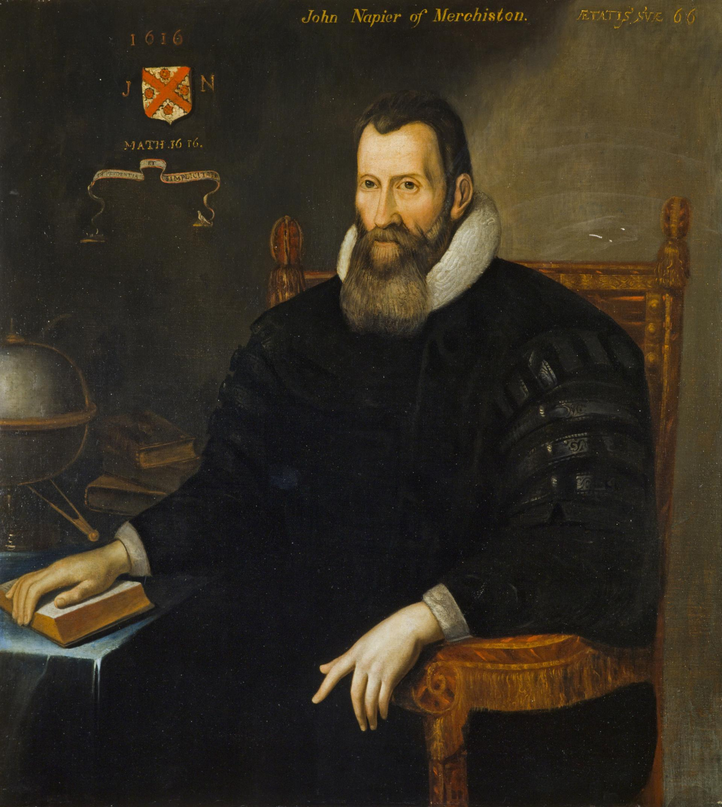

{ width=30% }

Lorsque l'astronomie s'est développée, les calculs nécessaires devenaient très compliqués et longs à réaliser à la main. Comment simplifier les calculs ?
John Neper (1550 - 1617) a inventé les logarithmes, qui en transformant de calculs de multiplications en calculs d'additions, a permis de grandes avancées dans ce domaine.

<iframe width="560" height="315" src="//embed.francetv.fr/0800b20d5651ac264f577bcd9a4a120d" frameborder="0" scrolling="no" allowfullscreen></iframe>

