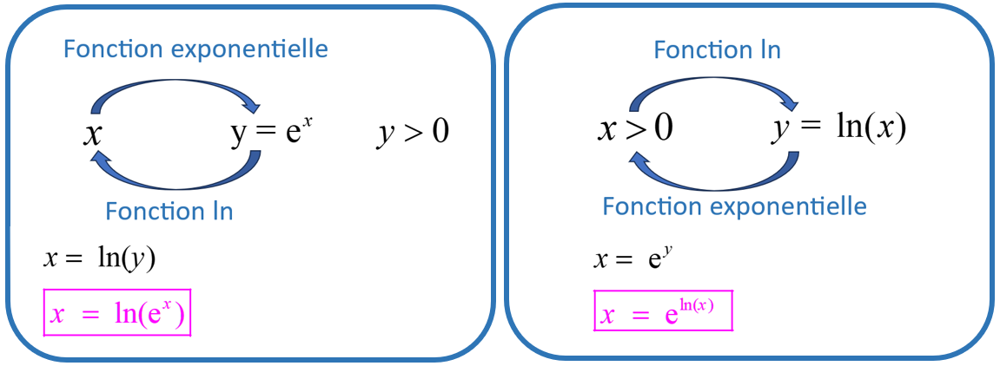
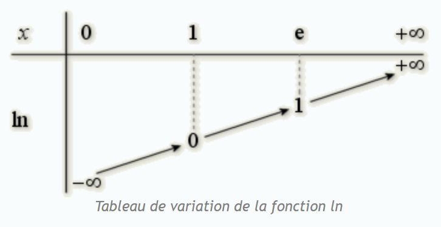

## I. Définition 1 : fonction réciproque de la fonction exponentielle

!!! info "Définition"

    La fonction logarithme népérien, notée $\text{ln}$ est  définie sur $]0;+ \infty[$

    $x>0$ et $y=\text{ln}(x) \Leftrightarrow x=\text{e}^y$ 

???+ question "Conséquences"

    **Compléter**

    $\text{e}^0=... \Leftrightarrow ...$

    $\text{e}^1=... \Leftrightarrow ...$

    $\text{e}^{-1}=... \Leftrightarrow ...$

    ??? success "Solution"

        $\text{e}^0=1 \Leftrightarrow \text{ln}(1)=0$

        $\text{e}^1=\text{e} \Leftrightarrow \text{ln}(\text{e})=1$

        $\text{e}^{-1}=\dfrac{1}{\text{e}} \Leftrightarrow \text{ln}(\dfrac{1}{\text{e}})=-1$

???+ question "Représentation graphique"

    **1.** Compléter le tableau suivant en utilisant la calculatrice :

    $$
    \begin{array}{|c|c|c|c|c|c|c|c|c|c|c|c|c|c|}
    \hline
    x & 0.1 & 0.2& 0.5& 1&2&4&6&8&10&12&14&16&18 \\
    \hline
    \text{ln}(x) &   &  & & & & & & & & & & &  \\
    \hline
    \end{array}
    $$

    ??? success "Solution"

        $$
        \begin{array}{|c|c|c|c|c|c|c|c|c|c|c|c|c|c|}
        \hline
        x & 0.1 & 0.2& 0.5& 1&2&4&6&8&10&12&14&16&18 \\
        \hline
        \text{ln}(x) & -2.3  & -1.6 & -0.7& 0& 0.7& 1.4& 1.8& 2.1&2.3 &2.5 &2.6 & 2.8&  2.9\\
        \hline
        \end{array}
        $$

    **2.** Faire la représentation graphique de la fonction $\text{ln}$

    ??? success "Solution"

        { width=60% }

??? note "fonctions réciproques et représentations graphiques"

    Les fonctions exponentielle et logarithme népérien étant récipriques l'une de l'autre, leurs courbes 
    représentatives sont symétriques par rapport à la droite d'équation $y=x$

    { width=40% }

??? note "Conséquence 1 : pour tout réel $x$ on a $\ln(\text{e}^x)=$?"

    $\boxed{\ln(\text{e}^x)=x}$

??? note "Conséquence 2 : pour tout réel $x$ strictement positif on a $\text{e}^{\ln(x)}=$?"

    $\boxed{\text{e}^{\ln(x)}=x}$

??? note "Illustrations : à mémoriser"

    { width=90% }

## II. Propriétés algébriques

???+ question "Exercice 1"

    En utilisant la calculatrice déterminer :

    * $\text{ln}(6)$
    * $\text{ln}(2) + \text{ln}(3)$
    * $\text{ln}(\dfrac{3}{2})$
    * $\text{ln}(3) - \text{ln}(2)$
    * $\text{ln}(2^{10})$
    * $10 \times \text{ln}(2)$

???+ question "Règles ce calcul"

    On suppose que $a>0$ et $b>0$

    Compléter dans chaque cas : 

    **$\text{ln}(ab) =$**

    ??? success "Solution"

        **$\text{ln}(ab) =\text{ln}(a)+ \text{ln}(b)$**

    **$\text{ln}(\dfrac{a}{b}) =$**

    ??? success "Solution"

        **$\text{ln}(\dfrac{a}{b}) =\text{ln}(a)- \text{ln}(b)$**

    **$\text{ln}(\dfrac{1}{a}) =$**

    ??? success "Solution"

        **$\text{ln}(\dfrac{1}{a}) =-\text{ln}(a)$**

    **$\text{ln}(a^n) =$**

    ??? success "Solution"

        **$\text{ln}(a^n) =n\text{ln}(a)$**

???+ question "Exercice 2"

    Recommencer cet exercice de très nombreuses fois, pour s'entraîner sur des situations différentes.

    <iframe src="https://euler-ressources.ac-versailles.fr/wims/wims.cgi?module=adm/raw&job=lightpopup&emod=H6/algebra/algpptylnexp.fr&parm=cmd=new;exo=simplify1;qnum=1;scoredelay=;seedrepeat=0;qcmlevel=1&option=noabout" width="100%" height="600"></iframe>

???+ question "Exercice 3"

    [Exercices de base](https://coopmaths.fr/alea/?uuid=3e6bf&id=TSA5-03&n=5&d=10&s=3&s2=true&s3=true&i=1&cd=1&alea=N7DE&uuid=b9c63&id=canTSpeAN02&n=8&d=10&s=4&s2=true&i=1&cd=1&alea=91L5&uuid=7c230%27+%2F%2F+Quand+on+ex%C3%A9cute+pnpm+start+la+premi%C3%A8re+fois%2C+le+terminal+renvoie+une+r%C3%A9f%C3%A9rence+d&id=canTSpeAN04&n=5&d=10&i=1&cd=1&alea=2Epv&uuid=bc8ae&id=TSA5-QCM02&n=1&d=10&s=false&s2=true&s4=false&i=1&cd=1&alea=T4bq&uuid=01eb1&id=TSA5-QCM05&n=1&d=10&s2=true&i=1&cd=1&alea=Hyf4&uuid=a601c&id=TSA5-QCM08&n=1&d=10&s2=true&i=1&cd=1&alea=YFPF&v=eleve&es=1111001){ .md-button target="_blank" rel="noopener" }

???+ question "Exercice 4"

    Recommencer cet exercice de très nombreuses fois, pour s'entraîner sur des situations différentes.

    <iframe src="https://euler-ressources.ac-versailles.fr/wims/wims.cgi?module=adm/raw&job=lightpopup&emod=H6/analysis/logexp1.fr&parm=cmd=new;exo=transflogexp;confparm1=1;confparm1=2;confparm1=3;confparm1=4;confparm1=5;confparm1=6;confparm1=7;confparm1=8;confparm1=9;confparm1=10;qnum=1;scoredelay=;seedrepeat=0;qcmlevel=1&option=noabout" width="100%" height="600"></iframe>

## III Equations et inéquations

!!! info "$a^x=k$ avec $a>0$ et $k>0$"

    **1.** Écrire l'équation de départ :
   
    $a^x = k$

    **2.** Prendre le logarithme des deux côtés du signe égale :
   
    $\ln(a^x) = \ln(k)$

    **3.** Appliquer la propriété des logarithmes :

    $x \cdot \ln(a) = \ln(k)$

    **4.** Isoler \(x\) :
   
    $x = \dfrac{\ln(k)}{\ln(a)}$

!!! example "Exemple"

    Résoudre \(2^x = 8\) 

    \[
    2^x = 8
    \]

    Prenons le logarithme naturel des deux côtés :
    
    \[
    \ln(2^x) = \ln(8)
    \]

    Appliquons la propriété des logarithmes :
    
    \[
    x \cdot \ln(2) = \ln(8)
    \]

    Isolons \(x\) :

    \[
    x = \frac{\ln(8)}{\ln(2)}
    \]

    Comme \(\ln(8) = \ln(2^3) = 3 \cdot \ln(2)\), nous obtenons : 

    \[
    x = \frac{3 \cdot \ln(2)}{\ln(2)} = 3
    \]

    Donc, l'ensemble de solutions est \(S =\{3\} \).

!!! info "Pour les inéquations"

    Soit $a$ et $b$ deux réels avec $a>0$ et $b>0$

    La fonction $\ln$ étant strictement croissante sur $]0; + \infty [$ : 

    Si $a<b$ alors $\ln(a) < \ln(b)$

???+ question "Exercice 5"

    Recommencer cet exercice de très nombreuses fois, pour s'entraîner sur des situations différentes.

    <iframe src="https://euler-ressources.ac-versailles.fr/wims/wims.cgi?module=adm/raw&job=lightpopup&emod=H6/algebra/algpptylnexp.fr&parm=cmd=new;exo=lnsuitegeo;qnum=1;scoredelay=;seedrepeat=0;qcmlevel=1&option=noabout" width="100%" height="600"></iframe>

???+ question "Exercice 6"

    [Exercices équations et inéquations](https://coopmaths.fr/alea/?EEEE2e0a294917e812d6281d0f22272e26ee2b2d20bd27961e8914bb2b1613f3272e13350f1c272e132b2e0a2949181b136b16890f22272e2104197a11a514572b1613f3272e13350f2c17e80f2c13a62da32dfa0f1c272e132b2e0a2949181726c5262a0f22272e2104197a11c61a5a12d30f2717e60f1d17e612c72d0a281a2a84277b2cff181b26312d320f2c146e281a2a84277b26f117e60f2e2dfe272e278927ec15e729491809208e14c21fc81e2515832e0a29491816152913680f22272e2104197a11c61a5a12d90f2f181a2a762e5e0f1e2d0a1336133612d1132b2d9a2d9d2792){ .md-button target="_blank" rel="noopener" }

## IV. Étude de la fonction logarithme népérien

!!! info "Définition"

    * La fonction $f : x \longmapsto \ln(x)$ est définie sur $]0, +\infty [$
    * La fonction $f$ définie par  $f(x)= \ln(x)$  est dérivable sur $]0, +\infty [$ et $f'(x)=\dfrac{1}{x}$
    * $\ln(1) = 0$

!!! info "Remarque"

    $\ln(\text{e})=1$

???+ question "Tableau de variation"

    **1.** Pour tout $x$ de $]0, +\infty [$, quel est le signe de $f'(x)$ ?

    ??? success "Solution"

        Pour tout $x \in ]0, +\infty [$ on a $f'(x)=\dfrac{1}{x}$ donc $f'(x)>0$

    **2.** En déduire le tableau de variation de $f$

    ??? success "Solution"

        { width=30% }
        _Equipe Académique Mathématiques, Rectorat de l'Académie de Bordeaux, France, 2003_

!!! info "Fonction composée"

    Soit $u$ une fonction dérivable strictement positive sur un intervalle $I$.  
    La fonction $f : x \longmapsto \ln (u(x))$ est dérivable sur $I$ et $f'(x)= \dfrac{u'(x)}{u(x)}$

!!! info "Limites usuelles"

    $$
    \lim_{\substack{x\to 0 \\ x>0}} \ln(x) = -\infty
    $$

    $$
    \lim_{x \to +\infty} \ln(x) = +\infty
    $$

!!! info "Limites et croissances comparées"

    Pour tout entier $n$ non nul : $\lim_{x \to +\infty} \dfrac{\ln(x)}{x^n} = 0$

    Pour tout entier $n$ non nul : $\lim_{\substack{x\to 0 \\ x>0}} x^n \ln(x) = 0$

    ??? tip "Astuce"

        Retenir que $\text{e}^x$ l'emporte sur $x^n$ qui l'emporte sur $\ln(x)$

???+ question "Exercice 7"

    [Exercices - fonction ln](https://coopmaths.fr/alea/?uuid=sti2d_2021_03_sujet0v2_mq5&alea=gkZT&uuid=sti2d_2021_06_metropole_j1_mq3&alea=gmhJ&uuid=sti2d_2021_06_metropole_j2_mq2&alea=zbNE&uuid=sti2d_2022_05_metropole_mq5&alea=fWND&uuid=bac_2021_09_metropole_10&alea=Am3s&v=eleve&es=1211001&title=){ .md-button target="_blank" rel="noopener" }

???+ question "Exercice 8"

    _D'après BAC Mars 2023 Centres étrangers G2 J1 exercice 1_

    On considère la fonction $g$ définie sur l'intervalle $]0~;~+\infty[$ par :  
    $g(x) = \ln \left(x^2\right) + x - 2$

    **Question 1**  
    On admet que la fonction $g$ est dérivable sur l'intervalle $]0~;~+\infty[$.  
    Étudier les variations de la fonction $g$ sur l'intervalle $]0~;~+\infty[$.

    ??? success "Solution"

        Sur $]0~;~+\infty[$, on a $g(x) = 2\ln x + x - 2$, d'où :

        $g'(x) = 2\times \dfrac1x + 1$.
        On a par composition de la dérivation :

        $g'(x) = 2 \times \dfrac1x + 1 = \dfrac{2 + x}{x}$.

        Comme $x > 0$, le signe de $g'(x)$ est celui de $2 + x$.

        Or $x > 0 \implies 2 + x > 2 > 0$, donc $g'(x) > 0$ sur l'intervalle $]0~;~+\infty[$.

        La fonction $g$ est donc croissante sur $]0~;~+\infty[$

    **Question 2**  
    Démontrer qu'il existe un unique réel dans l'intervalle $[1; 2]$ noté $\alpha$  tel que $g(\alpha) = 0$

    ??? success "Solution"

        $g(1) = - 1$ et $g(2) \approx1,4$  
        $g$ est continue et strictement croissante sur $[1~;~2]$, et $g(1)<0<g(2)$. Il existe donc un réel unique $\alpha \in [1~;~2]$ tel que $g(\alpha) = 0$.

    **Question 3**  
    Déterminer un encadrement de $\alpha$ d'amplitude $10^{-2}$.

    ??? success "Solution"

        Utilisons la méthode de balayage à l'aide de la calculatrice : 

        $g(1) = - 1$ et $g(2) \approx1,4$, donc $1 < \alpha < 2$ ;

        $g(1,3) \approx - 0,175$ et $g(1,4) \approx 0,07$, donc $1,3 < \alpha < 1,4$ ;

        $g(1,37) \approx - 0,0004$ et $g(1,38) \approx 0,02$, donc $1,37 < \alpha < 1,38$

