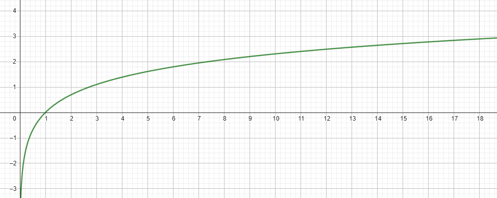
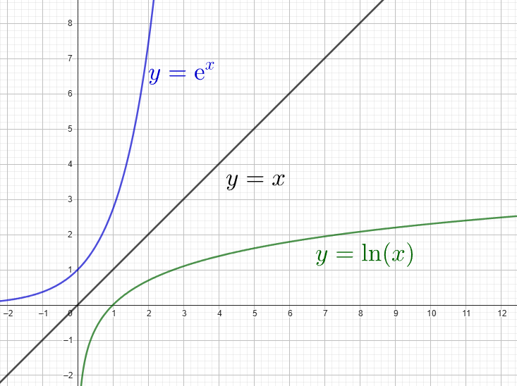

## I. Définition 1 : fonction réciproque de la fonction exponentielle

!!! info "Définition"

    La fonction logarithme népérien, notée $\text{ln}$ est  définie sur $]0;+ \infty[$

    $x>0$ et $y=\text{ln}(x) \Leftrightarrow x=\text{e}^y$ 

???+ question "Conséquences"

    **Compléter**

    $\text{e}^0=... \Leftrightarrow ...$

    $\text{e}^1=... \Leftrightarrow ...$

    $\text{e}^{-1}=... \Leftrightarrow ...$

    ??? success "Solution"

        $\text{e}^0=1 \Leftrightarrow \text{ln}(1)=0$

        $\text{e}^1=\text{e} \Leftrightarrow \text{ln}(\text{e})=1$

        $\text{e}^{-1}=\dfrac{1}{\text{e}} \Leftrightarrow \text{ln}(\dfrac{1}{\text{e}})=-1$

???+ question "Représentation graphique"

    **1.** Compléter le tableau suivant en utilisant la calculatrice :

    $$
    \begin{array}{|c|c|c|c|c|c|c|c|c|c|c|c|c|c|}
    \hline
    x & 0.1 & 0.2& 0.5& 1&2&4&6&8&10&12&14&16&18 \\
    \hline
    \text{ln}(x) &   &  & & & & & & & & & & &  \\
    \hline
    \end{array}
    $$

    ??? success "Solution"

        $$
        \begin{array}{|c|c|c|c|c|c|c|c|c|c|c|c|c|c|}
        \hline
        x & 0.1 & 0.2& 0.5& 1&2&4&6&8&10&12&14&16&18 \\
        \hline
        \text{ln}(x) & -2.3  & -1.6 & -0.7& 0& 0.7& 1.4& 1.8& 2.1&2.3 &2.5 &2.6 & 2.8&  2.9\\
        \hline
        \end{array}
        $$

    **2.** Faire la représentation graphique de la fonction $\text{ln}$

    ??? success "Solution"

        { width=60% }

??? note "fonctions réciproques et représentations graphiques"

    Les fonctions exponentielle et logarithme népérien étant récipriques l'une de l'autre, leurs courbes 
    représentatives sont symétriques par rapport à la droite d'équation $y=x$

    { width=40% }

## II. Propriétés algébriques

???+ question "Exercice 1"

    En utilisant la calculatrice déterminer :

    * $\text{ln}(6)$
    * $\text{ln}(2) + \text{ln}(3)$
    * $\text{ln}(\dfrac{3}{2})$
    * $\text{ln}(3) - \text{ln}(2)$
    * $\text{ln}(2^{10})$
    * $10 \times \text{ln}(2)$

???+ question "Règles ce calcul"

    On suppose que $a>0$ et $b>0$

    Compléter dans chaque cas : 

    **$\text{ln}(ab) =$**

    ??? success "Solution"

        **$\text{ln}(ab) =\text{ln}(a)+ \text{ln}(b)$**

    **$\text{ln}(\dfrac{a}{b}) =$**

    ??? success "Solution"

        **$\text{ln}(\dfrac{a}{b}) =\text{ln}(a)- \text{ln}(b)$**

    **$\text{ln}(\dfrac{1}{a}) =$**

    ??? success "Solution"

        **$\text{ln}(\dfrac{1}{a}) =-\text{ln}(a)$**

    **$\text{ln}(a^n) =$**

    ??? success "Solution"

        **$\text{ln}(a^n) =n\text{ln}(a)$**

???+ question "Exercice 2"

    [Exercices de base](https://coopmaths.fr/alea/?uuid=b9c63&id=canTSpeAN02&n=10&d=10&s=4&s2=true&cd=1&uuid=3e6bf&id=TSA5-03&n=12&d=10&s=3&s2=true&s3=true&cd=1&v=eleve&es=0111001&title=){ .md-button target="_blank" rel="noopener" }

???+ question "Exercice 3"

    Recommencer cet exercice de très nombreuses fois, pour s'entraîner sur des situations différentes.

    <iframe src="https://euler-ressources.ac-versailles.fr/wims/wims.cgi?module=adm/raw&job=lightpopup&emod=H6/algebra/algpptylnexp.fr&parm=cmd=new;exo=simplify1;qnum=1;scoredelay=;seedrepeat=0;qcmlevel=1&option=noabout" width="100%" height="600"></iframe>

???+ question "Exercice 4"

    Recommencer cet exercice de très nombreuses fois, pour s'entraîner sur des situations différentes.

    <iframe src="https://euler-ressources.ac-versailles.fr/wims/wims.cgi?module=adm/raw&job=lightpopup&emod=H6/analysis/logexp1.fr&parm=cmd=new;exo=transflogexp;confparm1=1;confparm1=2;confparm1=3;confparm1=4;confparm1=5;confparm1=6;confparm1=7;confparm1=8;confparm1=9;confparm1=10;qnum=1;scoredelay=;seedrepeat=0;qcmlevel=1&option=noabout" width="100%" height="600"></iframe>

## III Equations et inéquations

!!! info "$a^x=k$ avec $a>0$ et $k>0$"

    **1.** Écrire l'équation de départ :
   
    $a^x = k$

    **2.** Prendre le logarithme des deux côtés du signe égale :
   
    $\ln(a^x) = \ln(k)$

    **3.** Appliquer la propriété des logarithmes :

    $x \cdot \ln(a) = \ln(k)$

    **4.** Isoler \(x\) :
   
    $x = \dfrac{\ln(k)}{\ln(a)}$

!!! example "Exemple"

    Résoudre \(2^x = 8\) 

    \[
    2^x = 8
    \]

    Prenons le logarithme naturel des deux côtés :
    
    \[
    \ln(2^x) = \ln(8)
    \]

    Appliquons la propriété des logarithmes :
    
    \[
    x \cdot \ln(2) = \ln(8)
    \]

    Isolons \(x\) :

    \[
    x = \frac{\ln(8)}{\ln(2)}
    \]

    Comme \(\ln(8) = \ln(2^3) = 3 \cdot \ln(2)\), nous obtenons : 

    \[
    x = \frac{3 \cdot \ln(2)}{\ln(2)} = 3
    \]

    Donc, l'ensemble de solutions est \(S =\{3\} \).

!!! info "Pour les inéquations"

    Soit $a$ et $b$ deux réels avec $a>0$ et $b>0$

    La fonction $\ln$ étant strictement croissante sur $]0; + \infty [$ : 

    Si $a<b$ alors $\ln(a) < \ln(b)$

???+ question "Exercice 5"

    Recommencer cet exercice de très nombreuses fois, pour s'entraîner sur des situations différentes.

    <iframe src="https://euler-ressources.ac-versailles.fr/wims/wims.cgi?module=adm/raw&job=lightpopup&emod=H6/algebra/algpptylnexp.fr&parm=cmd=new;exo=lnsuitegeo;qnum=1;scoredelay=;seedrepeat=0;qcmlevel=1&option=noabout" width="100%" height="600"></iframe>