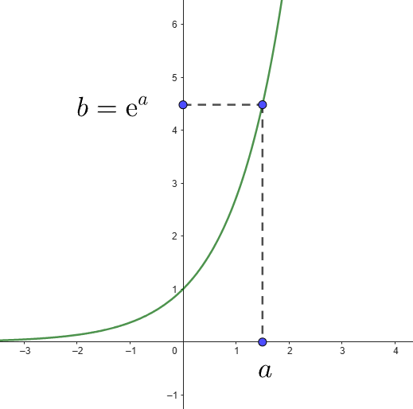
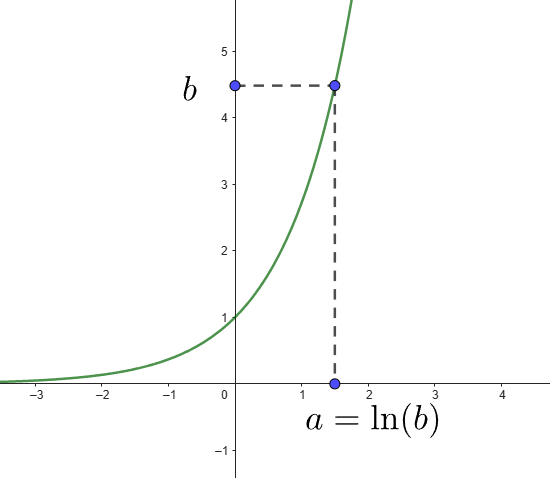
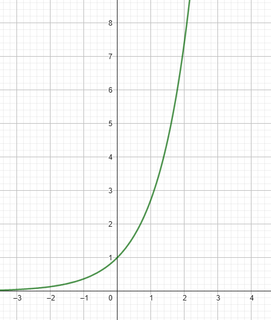
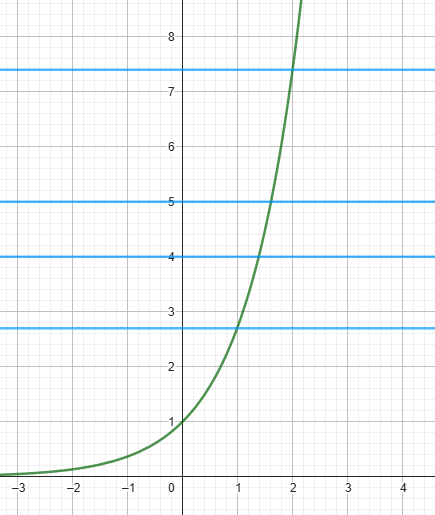

{ width=20% }

Lorsque l'astronomie s'est développée, les calculs nécessaires devenaient très compliqués et longs à réaliser à la main. Comment simplifier les calculs ?
John Neper (1550 - 1617) a inventé les logarithmes, qui en transformant de calculs de multiplications en calculs d'additions, a permis de grandes avancées dans ce domaine.

<iframe width="560" height="315" src="//embed.francetv.fr/0800b20d5651ac264f577bcd9a4a120d" frameborder="0" scrolling="no" allowfullscreen></iframe>

???+ question "Prérequis sur la fonction exponenetielle"

    Tracer une allure de la courbe représentative de la fonction exponentielle. Sur ce graphique ajouter un point illustrant $b=\text{e}^a$  

    ??? success "Solution"

        { width=30% }

??? note "Fonction réciproque"

    Soit $A(a; b)$ un point de la courbe de la fonction exponentielle. On a donc forcément **$b>0$**
    
    👉 L'antécédent de $b$ pour la fonction exponentielle est donc $a$.

    On note $a= \text{ln}(b)$

    👉 $\text{ln}(b)$ est le logarithme népérien de $b$

    { width=30% }

??? question "Exercice 1"

    Utiliser la courbe ci-dessous pour déterminer graphiquement $\text{ln}(4)$, $\text{ln}(5)$, $\text{ln}(7,4)$

    { width=30% }

    ??? tip "Aide"

        { width=30% }

    ??? success "Solution"

        Graphiquement on lit : 

        $\text{ln}(4) \approx 1,4$, $\text{ln}(5) \approx 1,6$, $\text{ln}(7,4) \approx 2$

    Vérifier les résultats obtenus à l'aide de la touche <kbd>$\text{ln}$</kbd> de la calculatrice

    
???+ question "Exercice 2"

    Compléter : 

    La fonction logarithme népérien est définie pour tout réel $x$ ... 

    $y=\text{ln}(x) \Leftrightarrow$ ...

    ??? success "Solution"

        La fonction logarithme népérien est définie pour tout réel $x>0$
        
        $y=\text{ln}(x) \Leftrightarrow x=\text{e}^y$ 

