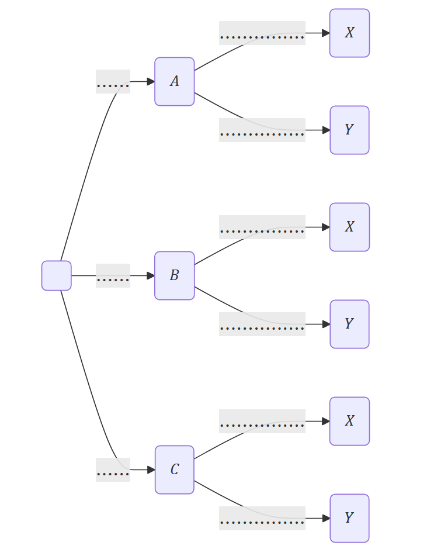
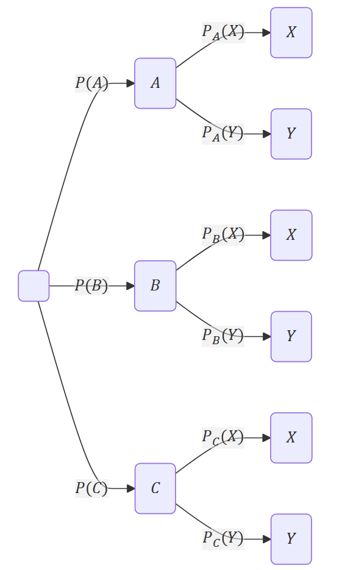
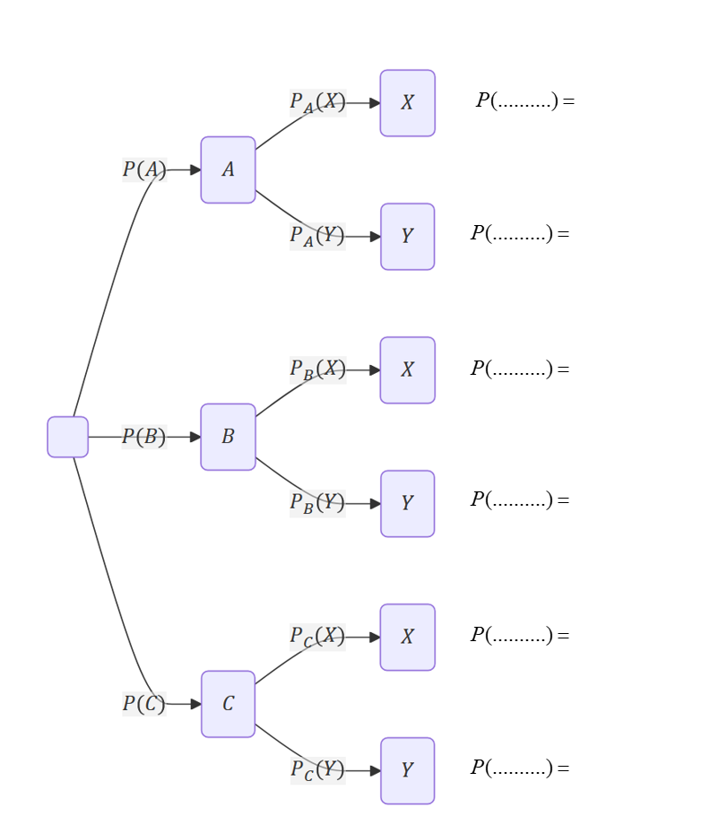
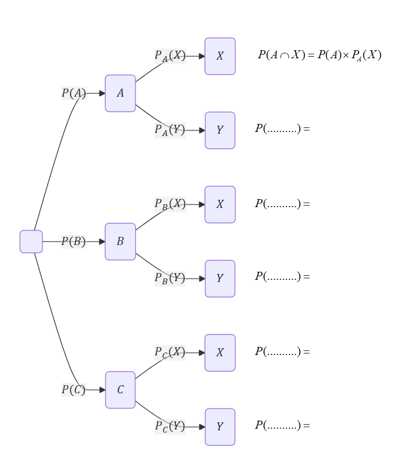
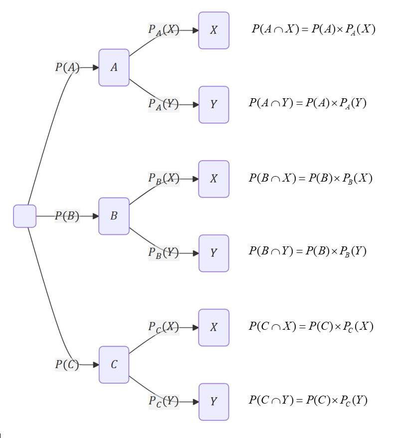
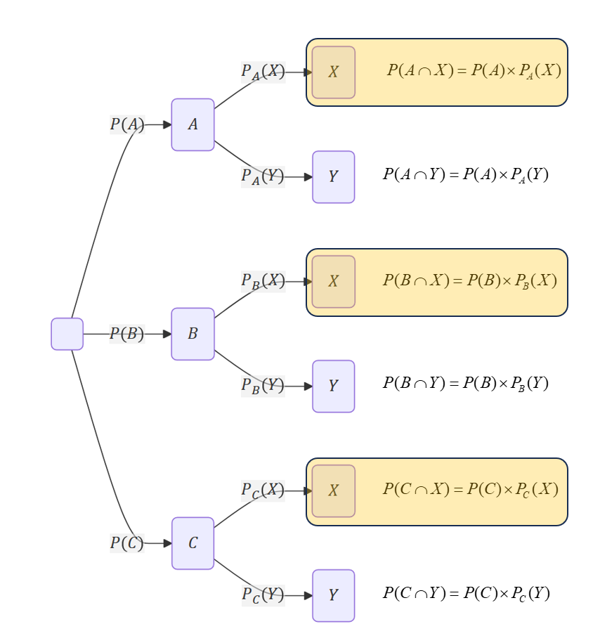

## I. Révisions

[Cours de probabilité vu en SIO 1](a_telecharger/SIO1.UF2.CHAP05.Probas.elementaires.pdf){ .md-button target="_blank" rel="noopener" }

## II. Visualisation

???+ question "Probabilités et probabilités conditionnelles"

    Recopier et compléter l'arbre suivant : 

    { width=40% }

    ??? tip "Indice"

        { width=40% }

    ??? success "Solution"

        { width=40% }

???+ question "Probabilités et intersections d'événements"

    **1.** Recopier et compléter l'arbre suivant :

    ??? note pliée "arbre à recopier et compléter"

        { width=40% }

    ??? tip "Indice 1"

        { width=40% }

    ??? tip "Indice 2"

        La probabilité au bout d'un chemin de l'arbre s'obtient en multipliant entre elles les probabilités 
        présentes sur toutes les arêtes de ce chemin.

    ??? success "Solution"

        { width=40% }

    **2.** Rerouver en regardant le chemin du haut de l'arbre la formule donnant $P_A(X)$

    ??? tip "Indice 1"

        On peut calculer $P(A \cap X)$ en fonction de $P(A)$ et de $P_A(X)$

    ??? success "Solution"

        $$
        P(A \cap X) = P(A) \times P_A(X)
        $$

        On a donc : 

        $$
        P_A(X) = \dfrac{P(A \cap X)}{P(A)}
        $$

???+ question "Formule des probabilités totale"

    Observer l'arbre ci-dessous, et en déduire $P(x)$ par la loi des probabilités totales.

    ??? note pliée "arbre à recopier et compléter"

        { width=40% }

    
    ??? success "Solution"

        $$
        P(X)=P(A \cap X)+P(B \cap X)+P(C \cap X)
        $$

        On en déduit que

        $$
        P(X)=P(A) \times P_A(X) + P(B) \times P_B(X) + P(C) \times P_C(X)
        $$

!!! info "Méthode"

    🌲 Pour résoudre un exercice, **même si ce n'est pas demandé**, commencer par tracer l'arbre.  
    🤣 Il suffit ensuite de savoir l'utiliser.

## III. Exercices sur les probabilités conditionnelles

[Exercices sur les probabilités conditionnelles - Série 1](https://coopmaths.fr/alea/?uuid=9ccfd&id=1P10&n=4&d=10&s=false&s2=3&cd=1&v=eleve&es=0111001&title=){ .md-button target="_blank" rel="noopener" }

