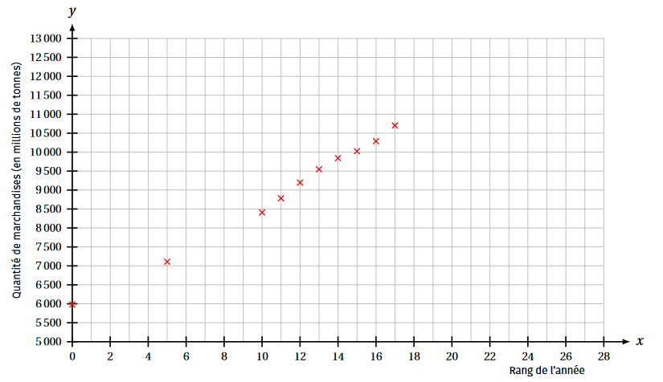
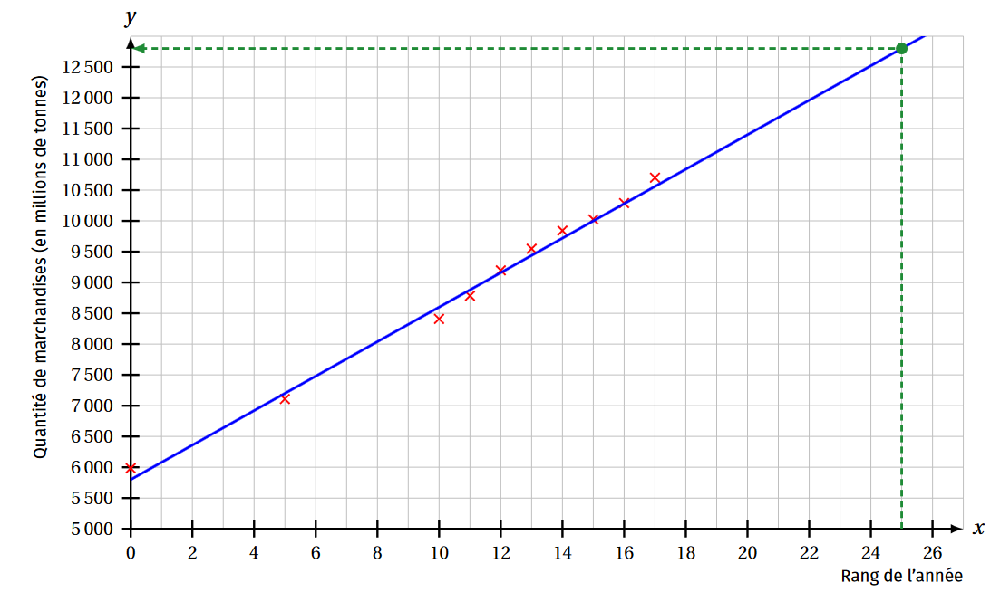

## Exercice 1

???+ question "Exercice 1"

    Lors d'une enquête réalisée auprès de 500 personnes, on a estimé le nombre de personnes prêtes à acheter un nouveau produit en fonction du prix de ce produit :

    Prix proposé en euros ($x_i$) | 52 | 47 | 44 | $38,5$ | $35,5$ | 32 | 31 | 28 |
    |:---|:----:|:----:|:----:|:----:|:----:|:----:|:----:|:----:|
	Nombre d'acheteurs potentiels ($y_i$) | 80 | 125 | 145 | 200 | 225 | 250 | 265 | 280|

    **1.** Question 1  
    Représenter **à la main sur votre feuille** le nuage de points $(x_i;y_i)$ en prenant 1 cm pour 5 euros en abscisse (de 15 à 60) et 1 cm pour 50 personnes en ordonnée (de 0 à 400).

    ??? success "Solution"

        { width=50% }

    **2.** Question 2  
    Déterminer l'équation de la droite de régression de $y$ en $x$ sous la forme $y = ax + b$ en arrondissant $a$ à 2 décimales et $b$ à l'entier, ainsi que le coefficient de corrélation associé arrondi à 4 décimales.
	
	Cet ajustement linéaire vous parait-il raisonnable ?

    ??? success "Solution"

        La calculatrice nous donne $y=-8,53x+525$ et $r \approx -0,9986$ qui est très proche de $-1$.
	
	    On peut donc dire que l'ajustement est très raisonnable.

    **3.** Question 3  
    Tracer cette droite sur le graphique et placer le point moyen de ce nuage.

    ??? success "Solution"

        La droite d'ajustement a été tracée en utilisant le point moyen et 
        $\left\{\begin{matrix}
        x=28 \Rightarrow y=286,16 \\ 
        x=52 \Rightarrow y = 81,44 
        \end{matrix}\right.$

    **4.** Question 4   
    En utilisant cet ajustement :

	* Quel prix maximal doit-on proposer pour que plus de 60 % des personnes interrogées soient prêtes à l'acheter ?
    * Au-delà de quel prix le taux d'acheteurs potentiels tombe-t-il sous les 10 % ?

    ??? success "Solution"

        Grâce à cet ajustement on voit que :
    
        * Le prix maximal que l'on doit proposer pour que plus de 60 % des personnes interrogées (soit 300) soient prêtes à l'acheter est d'environ 26 €.
        * Au-delà de 56 €, le taux d'acheteurs potentiels tombe sous 50 %.

## Exercice 2

???+ question "Exercice 2"

    Le tableau ci-dessous donne les quantités de marchandises transportées dans le monde par voie maritime entre 2000 et 2017, exprimées en millions de tonnes.

    $$\begin{array}{lll}
	Année& 2000& 2005& 2010& 2011& 2012& 2013 &2014& 2015& 2016 &2017\\
	Rang de l'année: $x_i$ &0& 5& 10& 11& 12& 13& 14& 15& 16& 17\\
	Quantité de marchandises en millions de tonnes $y_i$ & 5984 & 7109 & 8409 & 8784 & 9197 & 9548 & 9842 & 10024 & 10289 & 10702\\
    \end{array}$$

    Le nuage de points de coordonnées $(x_i;y_i)$ est donné ci-dessous :

    { width=50% }

    **1.** Question 1  
    Expliquer pourquoi ce nuage de points permet d'envisager un ajustement affine.

    ??? success "Solution"

        Le nuage de points a une forme allongée, donc un ajustement affine est envisageable.

    **2.** Question 2  
    Déterminer à l'aide de la calculatrice l'équation réduite de la droite d'ajustement de $y$ en $x$ obtenue par la méthode des moindres carrés. On arrondira les coefficients au dixième.

    ??? success "Solution"

        La calculatrice donne $y = 281,0x + 5813,4$ avec les coefficients arrondis au dixième.

    **3.** Question 3  
    On décide de modéliser la quantité de marchandises $y$ en fonction du rang de l'année $x$ par l'expression $y = 280x + 5800$.

    Tracer la droite $D$ d'équation $y = 280x + 5800$ dans un repère identique à celui donné précédemment.

    ??? success "Solution"

        { width=50% }

    **4.** Question 4  
    Estimer, selon le modèle de la question 3, la quantité de marchandises transportées par voie maritime en 2025, en expliquant la démarche suivie.

    ??? success "Solution"

        Dans cette question, il s'agit de faire une prévision pour $x=25$ :
	
	    * pour $x = 25$ on lit pour $y$ environ 12800;
	    * avec $x = 25$, on obtient $y = 280\times 25 + 5800 = 7000 + 5800 = 12800$.
	
	    Ainsi on on obtient une estimation de 12800 millions de tonnes.

   

