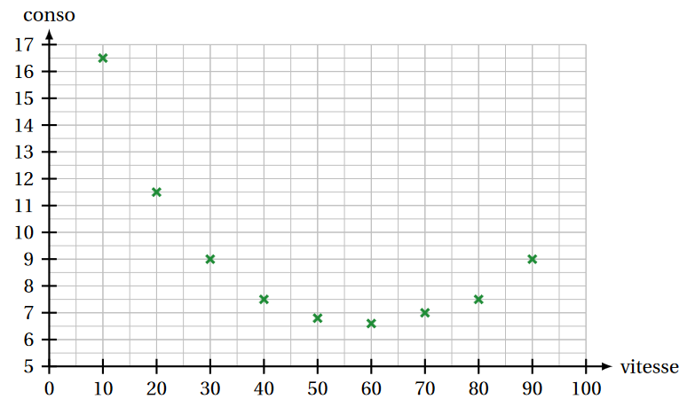
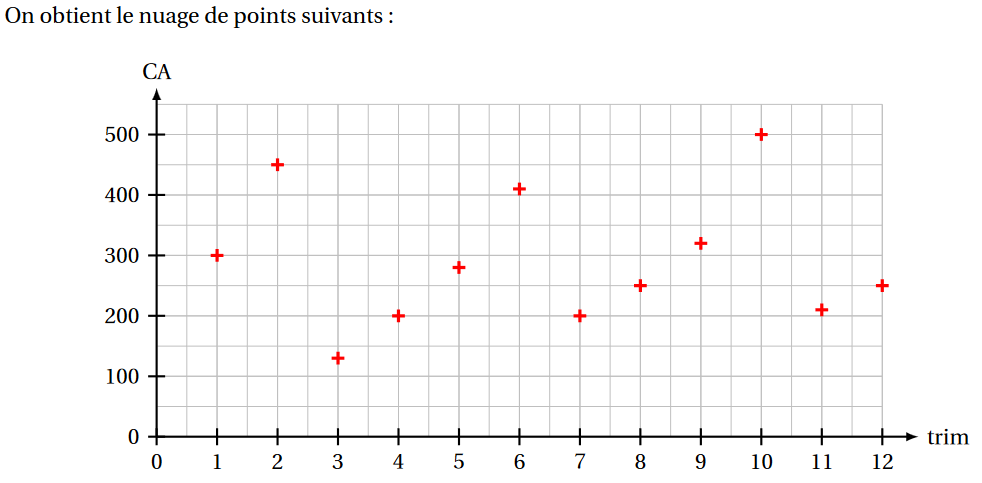
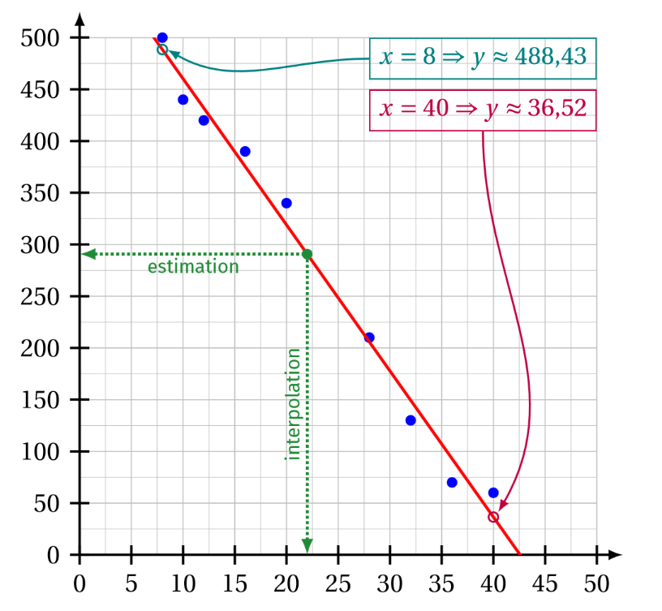

## I. Introduction

!!! info "Pourquoi des statistiques à deux variables?"

    Existe-t-il un lien (statistique, c’est-à-dire mathématique, et non de cause à effet ) entre deux caractères d’une
    population ? Pour cela, on étudie simultanément les deux caractères et on présente les résultats sous forme
    de tableaux ou de graphiques

!!! info "Trois exemples"

    !!! example "Exemple 1"

        Une société a mis au point un nouveau matériel destiné aux PME de logistique et mène un enquête dans la 
        région de Provence-Alpes-Côte d’Azur auprès de 500 entreprises aptes à recevoir ce matériel, pour déterminer 
        à quel prix chacune de ces entreprises accepterait d’acquérir ce nouveau matériel.

        Le **nuage de point** suivant montre une corrélation entre le prix et le nombre d'entreprises prêtes à acheter 
        à ce prix.  
        Vu la forme de ce nuage de point, nous ferons un **ajustement** affine (par une droite)

        { width=30% }

    !!! example "Exemple 2"

        Pour des véhicules légers de la gamme 9 à 11 chevaux de puissance fiscale, roulant en palier (ou en descente), 
        on a relevé les consommations moyenne et les vitesses.

        Le **nuage de point** suivant montre une corrélation entre consommation moyenne et les vitesse.  
        Vu la forme de ce nuage de point, nous ferons un **ajustement** par une parabole.

        { width=30% }

    !!! example "Exemple 3"

        Les chiffres d’affaires trimestriels d’une grande entreprise ont été, pour les 12 derniers trimestres 

        Le **nuage de point** suivant montre qu'il n'y a pas de corrélation entre le numéro du trimestre et 
        le chiffre d'affaire réalisé ce trimestre-là.

        { width=30% }

??? warning "Corrélation ne signifie pas lien de cause à effet"

    Une corrélation mathématique **ne signifie pas** qu'il y a nécessairement un lien de cause à effet. 

    <iframe width="560" height="315" src="https://www.youtube.com/embed/I9q4DEppGbo?si=mu1o-yGitw6gNDh_" title="YouTube video player" frameborder="0" allow="accelerometer; autoplay; clipboard-write; encrypted-media; gyroscope; picture-in-picture; web-share" referrerpolicy="strict-origin-when-cross-origin" allowfullscreen></iframe>

## II. Nuage de points

!!! info "Nuage de points"

    Reprenons l'exemple 1 : 

    |Prix proposé en milliers d’euros $x_i$ | 40 | 36 | 32 | 28 | 24 | 20 | 16 | 12 | 10 | 8 |
	|:---|:----:|:----:|:----:|:----:|:----:|:----:|:----:|:----:|:----:|:----:|
    |Nb d’entreprises disposées à acheter à ce prix $y_i$ | 60 | 70 | 130 | 210 | 240 | 340 | 390 | 420 | 440 | 500 |

    Si on place dans un repère les points $M_i (x_i;y_i)$, le graphique obtenu est appelé **nuage de points** de la série statistique.
    
    ⚠️ On ne doit pas relier ces points !.

    { width=30% }

!!! info "Ajustement d'un nuage"

    Le nuage étant dessiné, on peut essayer de trouver une fonction $f$ dont la courbe passe « le plus près possible » des points du nuage : c’est le problème de **l’ajustement**

    Lorsqu’une telle fonction $f$ existe on dit qu’il y a une **corrélation** entre les deux caractères.

!!! info "Point moyen d'un nuage"

    Le point moyen d’un nuage de points $M_i (x_i;y_i)$ est le point $G(\overline{x};\overline{y})$.

???+ "Exemple 1 : à vous de jouer"

    Déterminer les coordonnées du point moyen $G_1$ pour l'exemple 1.

    Vous pouvez vous aider de la calculatrice.

    ??? success "Solution"
    
        Pour l'exemple 1, le point moyen est $G_1(22,6;280)$

## III. Ajustement affine

!!! info "Méthode empirique au jugé"

    On peut tracer, au **jugé** une droite qui passe « au plus près » des points du nuage.

    👉 On admet que les « meilleures » droites d’ajustement sont celles qui passent par le point moyen du nuage.

!!! info "Méthode des moindres carrés"

    On utilise la calculatrice ou un logiciel qui donne par cette méthode : 

    * le coefficient de corrélation $r$.  
    Si $|r|$ est proche de 1 (c'est à dire $r$ proche de 1 ou de -1) il est légitime de chercher un ajustement affine.

    * l'équation réduite de la droite de régression de $y$ en $x$ sous la forme $y = ax + b$.

    On vérifie que le point moyen est bien sur la droite d’ajustement.

??? warning "S $r$ n'est pas prpche de 1 ni de -1"

    Déterminer un ajustement affine est inutile : il faut alors se tourner vers des ajustements plus compliqués (à l'aide de polynômes ou autres fonctions)

??? tip "Astuce pour tracer la droite de régression"

    Une fois l'équation de la droite de régression par la méthode deds moindres carrés obtenue, il **suffit** de déterminer deux points de cette droite (on rappelle qu'elle passe par le point moyen !) pour la tracer.

    On peut essayer de prendre comme abscisses de ces points les valeurs minimale et maximale de la variable $X$.

!!! info "Prévisions ou interpolations"

    On peut utiliser l'ajustement pour faire des prévisions (« futur ») ou faire de l’interpolation (« passé »).

!!! example "Exemple"

    On considère les données :

    |Valeurs $x$ | 40 | 36 | 32 | 28 | 20 | 16 | 12 | 10 | 8 |
    |:---|:----:|:----:|:----:|:----:|:----:|:----:|:----:|:----:|
	|Valeurs $y$ | 60 | 70 | 130 | 210 | 340 | 390 | 420 | 440 | 500|
 
    La calculatrice donne $a \approx -14,12$ et $b \approx 601,41$.  
    Donc, pour $x=22$, $y \approx a \times 22 + b \approx 290,72$.

    { width=50% }

!!! info 

    On peut « transformer » l’un des deux paramètres (ou les deux) de la série à l’aide d’une certaine fonction :

	* on obtient un nouveau nuage de points (généralement de forme "allongée");
	* on détermine l’équation de la droite d’ajustement;
	* on revient aux variables initiales.

## Usage de la calculatrice

!!! info "Différentes calculatrices"

    [CASIO](a_telecharger/calc_statistique_a_deux_variables_casio.pdf){ .md-button target="_blank" rel="noopener" }

    [Numworks](a_telecharger/calc_statistique_a_deux_variables_numworks.pdf){ .md-button target="_blank" rel="noopener" }

    [Texas](a_telecharger/calc_statistique_a_deux_variables_ti83.pdf){ .md-button target="_blank" rel="noopener" }

