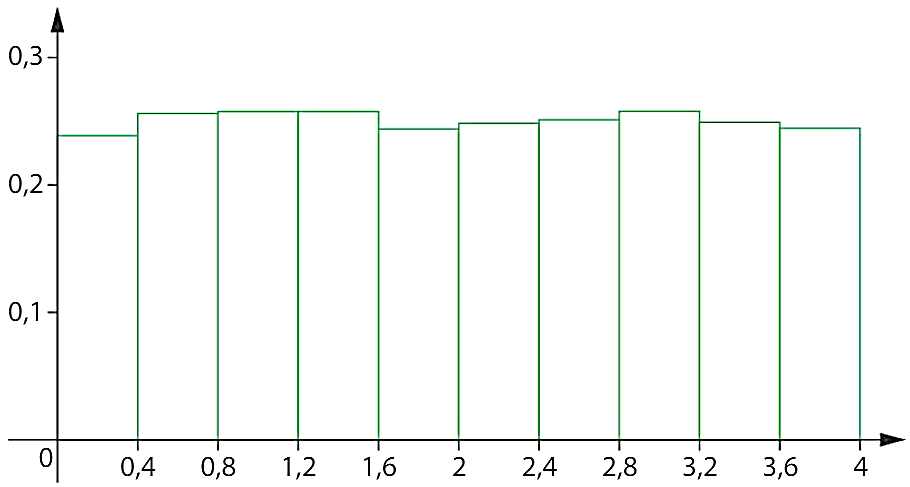
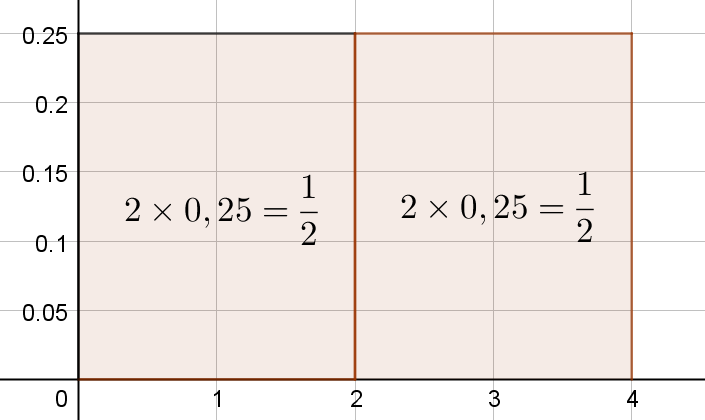
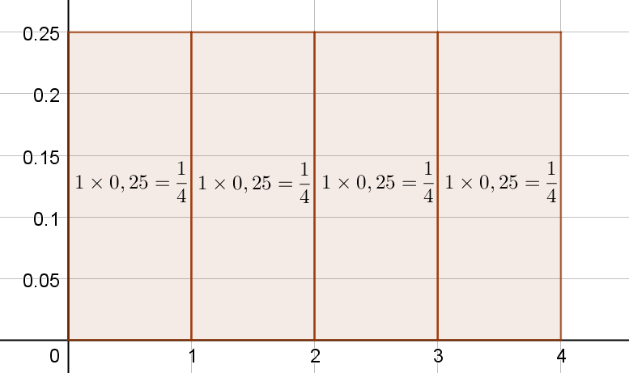
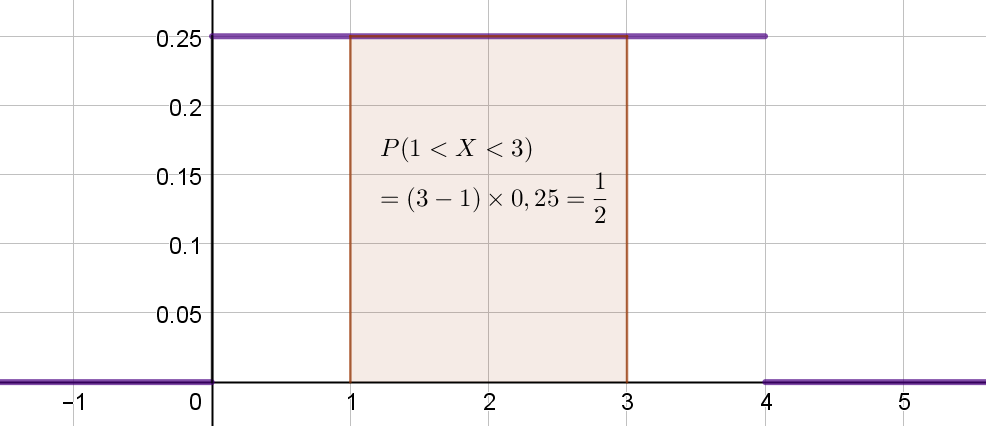

## I. Loi uniforme

!!! info "Loi uniforme continue"

    La loi uniforme sur un intervalle est la version continue d'équiprobabilité dans le cas d'un nombre fini d'issues.

!!! example "Exemple"

    Voici l'histogramme des fréquenes pour un échantillon de taille $10 000$ d'une varable aléatoire $X$ suivant une loi uniforme sur l'intervalle $[0; 4]$ (Cela signifie que $X$ peut prendre comme valeurs tous les réels de $[0; 4]$)

    { width=30% }

    L'axe des ordonnée est gradué de façon à ce que l'aire de chaque rectangle soit égale à la probabilité de la classe (c'et-à-dire de l'intervalle) correspondante.

    On lit donc $P(0,8<X<1,2)=0,25 \times(1,2 - 0,8)=0,25 \times 0,4 = 0,1$

    Déterminer $P(0,8<X<1,6)$

    ??? success "Solution"

        D'après l'histogramme : $P(0,8<X<1,6) = 0,25 \times(1,6 - 0,8)=0,25 \times 0,8 = 0,2$

???+ question "Loi uniforme sur $[0; 4]$"

    $X$ suit une loi uniforme sur $[0; 4]$ si tous les intervalles de même amplitude inclus dans [0 ;4]  ont la même probabilité d’être obtenus.

    $X$ peut prendre comme valeurs tous les réels de $[0; 4]$ et aucune autre.

    On a donc $P(0<X<4)=1$

    $P(0<X<2)= P(2<X<4)$ et $P(0<X<2) + P(2<X<4) = 1$

    On a donc $P(0<X<2)= P(2<X<4) = \dfrac{1}{2}$

    En procédant de même on peut montrer que $P(0<X<1)= P(1<X<2)=P(2<X<3)=P(3<X<4)=\dfrac{1}{4}$

    { width=30% }
    { width=30% }

!!! II. Densité de probabilité

info "fonction densité de probabilité"

    On a représenté ci-dessous la fonction $f$ suivante : 

    $$
    \begin{cases}
    f(x) = 0,25 \quad \text{si} \quad 0<x<4 \\
    f(x)=0 \quad \text{sinon}
    \end{cases}  
    $$

    { width=30% }

    On remarque que $P(a<X<b)$ s'obtient en calculant l'aire sous la courbe représentative de $f$

    On dit que $f$ est la fonction densité de probabilité de la variable aléatoire $X$ qui suit une loi uniforme sur $[0; 4]$

    $P(a \leq X \leq b) = \int_a^b f(x)\text{d}x$

    

