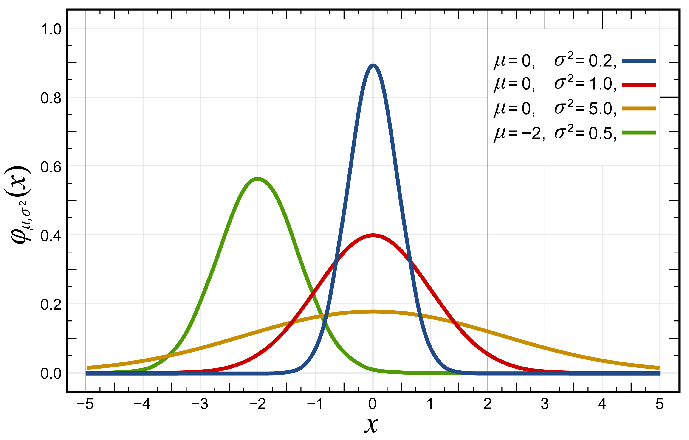

## I. La loi normale

!!! info "Modélisation de nombreux phénomènes"

    Les lois normales sont parmi les lois de probabilité les plus utilisées pour modéliser des phénomènes naturels issus de plusieurs événements aléatoires, possédant de nombreuses causes indépendantes.  
    Elles sont également appelées lois gaussiennes, lois de Gauss ou lois de Laplace-Gauss des noms de Laplace (1749-1827) et Gauss (1777-1855), deux mathématiciens, astronomes et physiciens qui les ont étudiées.

!!! info "Les paramètres"

    Plus formellement, une loi normale est une loi de probabilité continue qui dépend de deux paramètres : son espérance, un nombre réel noté μ, et son écart type, un nombre réel positif noté σ. On la note  $\mathscr{N} (\mu;\sigma)$

    { width=40% }

    _Inductiveload, Public domain, via Wikimedia Commons_

!!! info "Fonction densité d'une' loi normale"

    ⚠️ La formule donnée ci-dessous n'est pas à mémoriser.

    La loi normale notée $\mathscr{N}(m;\sigma)$ d’espérance (ou de moyenne) $m$ et d’écart type $\sigma$ est la loi continue dont la fonction de densité est définie sur $\mathbb{R}$ par : $f(t)=\dfrac{1}{\sigma \sqrt{2\pi}}\text{e}^{-\tfrac12 \left( \tfrac{t-m}{\sigma}\right)^2}$

    Si $X$ est une variable aléatoire continue qui suit une loi normale dont la fonction densité de probabilité est la fonction $f$ donnée ci-dessus, alors : 

    $$P(X \leq k) = \int_{-\infty}^k f(t) \text{d}t$$

!!! info "Visualiser certaines probabilités remarquables"

    Cocher un des trois intervalles proposés pour visualiser respectivement : 

    * $P(\mu - \sigma \leq X \leq \mu + \sigma)$
    * $P(\mu - 2 \sigma \leq X \leq \mu + 2 \sigma)$
    * $P(\mu - 3 \sigma \leq X \leq \mu + 3 \sigma)$

    <iframe scrolling="no" title="Loi normale et courbe de Gauss" src="https://www.geogebra.org/material/iframe/id/cSyoE2uD/width/1311/height/576/border/888888/sfsb/true/smb/false/stb/false/stbh/false/ai/false/asb/false/sri/false/rc/false/ld/false/sdz/false/ctl/false" width="1311px" height="576px" style="border:0px;"> </iframe>

???+ question "Visualiser certaines propriétés"

    Soit $f$ la fonction densité de probabilité de la loi normale de moyenne $m$ et d’écart type $\sigma$

    **1.** Que vaut l'aire totale sous la courbe de $f$ ?

    ??? success "Solution"

        L'aire totale sous la courbe de $f$ est égale à 1 car $P( - \infty \leq X \leq + \infty) = 1$

    **2.** En observant la symétrie de la courbe de $f$ que peut on déduire pour $P(X \leq m)$ et $P(X \geq m)$ ?

    ??? success "Solution"

        $P(X \leq m) = P(X \geq m) = 0,5$

    **3** Donner $P( a \leq X \leq b)$ en fonction de $P(X \leq a)$ et de $P(X \leq b)$

    ??? success "Solution"

        $P( a \leq X \leq b) = P(X \leq b) - P(X \leq a)$

    **4.** Donner $P(X \geq a)$ en fonction de $P(X \leq a)$

    ??? success "Solution"

         $P(X \geq a) = 1 - P(X \leq a)$

    **5** En vous aidant de la figure vue ci-dessus déterminer 

	* $P( m - \phantom{3}\sigma \leq X \leq m + \phantom{3}\sigma)$
	* $P( m - 2\sigma \leq X \leq m + 2\sigma)$
	* $P( m - 3\sigma \leq X \leq m + 3\sigma)$

    ??? success "Solution"

        * $P( m - \phantom{3}\sigma \leq X \leq m + \phantom{3}\sigma) \approx 0,68$ 
        * $P( m - 2\sigma \leq X \leq m + 2\sigma) \approx 0,95$ 
        * $P( m - 3\sigma \leq X \leq m + 3\sigma) \approx 0,997$

## II. Approximation d'une loi binomiale par une loi normale

!!! info "Approximation d'une loi discrète par une loi continue"

    Si $n$ est grand et $p$ n’est "ni trop voisin de 0 ni trop voisin de 1" \fg{}" alors la loi binomiale $\mathscr{B}(n;p)$ peut être approchée par la loi normale $\mathscr{N} (m;\sigma)$ de même espérance et de même écart type. $m=np \quad \text{et} \quad \sigma=\sqrt{np(1-p)}$

    En pratique, l’approximation sera considérée comme valable lorsque $n \geq 30$, $np \geq 5$ et $n(1-p) \geq 5$. 

!!! info "Correction de continuité"

    Pour "compenser" les erreurs dues à l'approximation d'une variable discrète par une variable continue, on doit procéder à une correction de continuité :

    * La variable aléatoire $X$ qui suit une loi $\mathscr{B}(n;p)$ est approchée par la variable aléatoire $Y$ qui suit une loi normale  $\mathscr{N}(np;\sqrt{np(1-p)})$
    * $P(a \leq X \leq b) = P( a-0,5 \leq Y \leq b+0,5)$.

## III. Utilisation des calculatrices

## IV. Exercices

 

## Crédits
Wikipédia, 